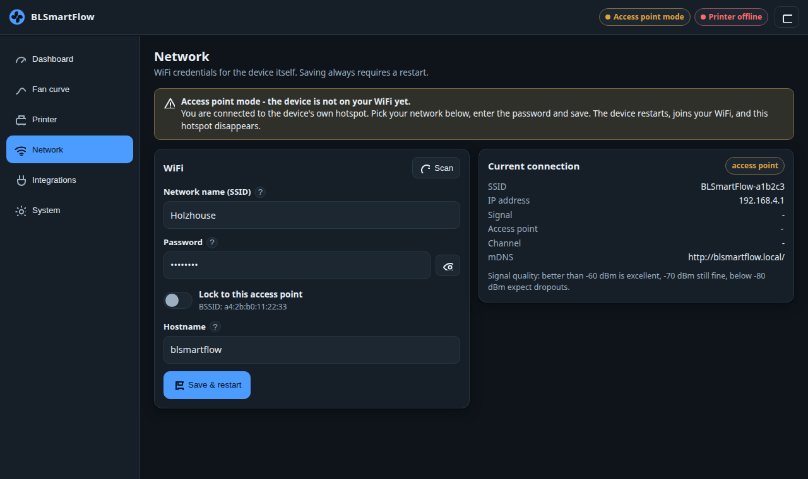
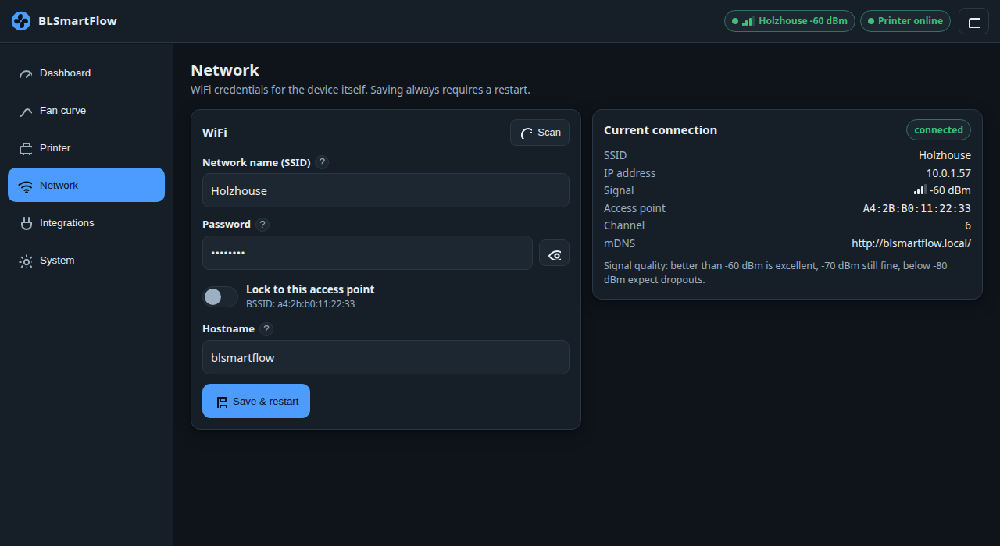
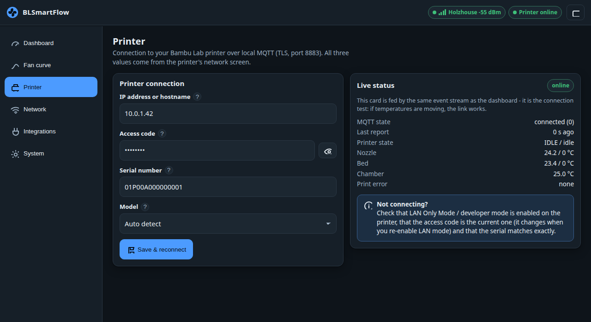
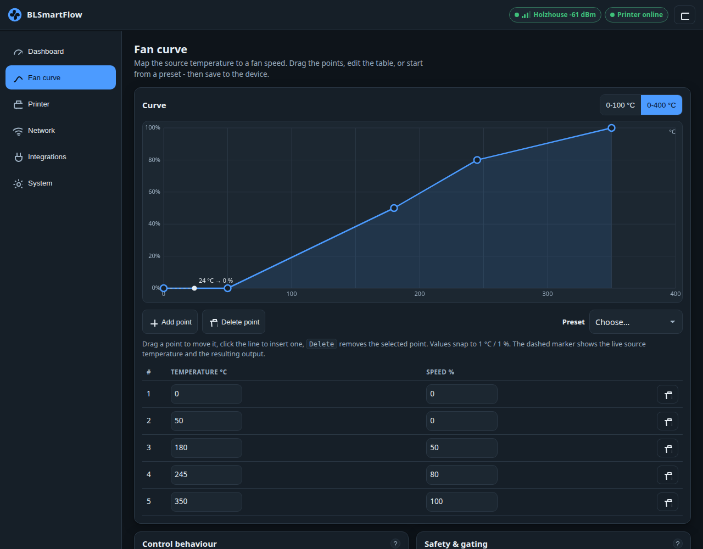
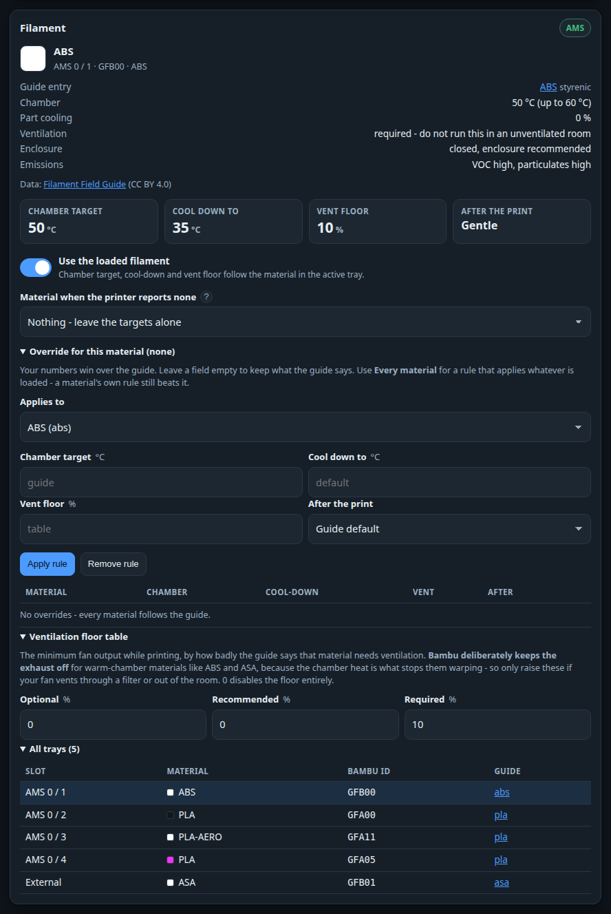
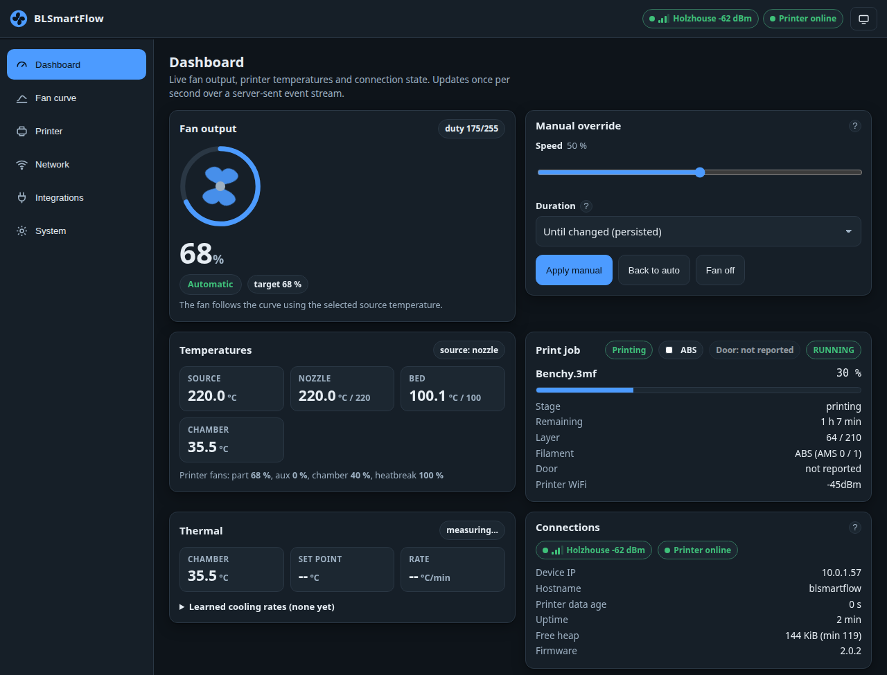
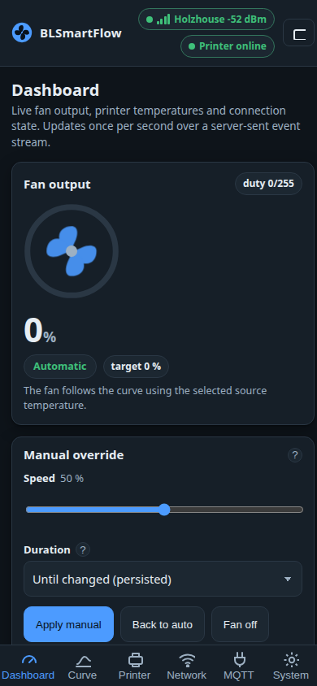
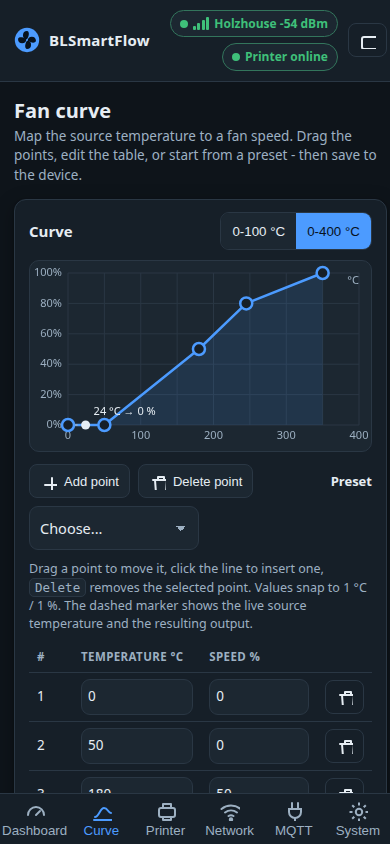
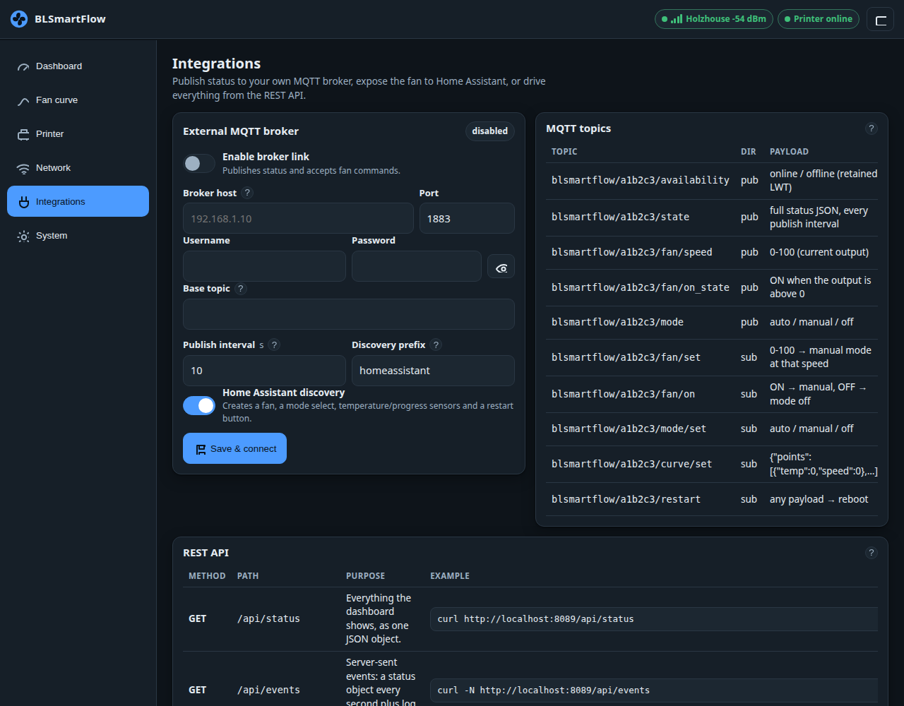
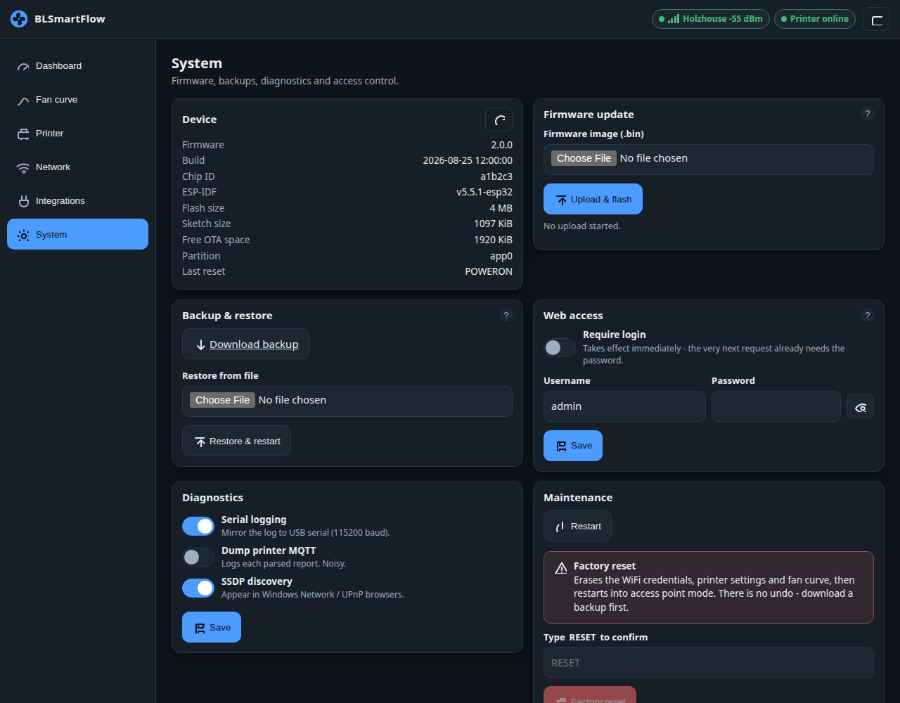

# BLSmartFlow 2.0 — User guide

BLSmartFlow is a small ESP32 board that drives one or two fans from your Bambu Lab printer's
temperatures. It reads the printer over the printer's own local MQTT link, looks the temperature up
in a curve you draw in your browser, and sets the fan speed. It can also work the other way round —
hold the enclosure at a temperature you pick and adjust the fan until it gets there — and it knows
to leave the fan alone while the printer is warming up or the door is open. It also reads which
filament is loaded and picks the right temperatures for it on its own. Everything is configured
from a web page on the device itself — no app, no cloud account.

This guide assumes you have never flashed an ESP32 before. Follow it top to bottom.

| Section | |
|---|---|
| [1. What you need](#1-what-you-need) | hardware, printer settings, the three printer values |
| [2. Flashing the firmware](#2-flashing-the-firmware) | web flasher or `esptool` |
| [3. First-time setup over the setup network](#3-first-time-setup-over-the-setup-network) | captive portal, WiFi credentials |
| [4. Connecting the printer](#4-connecting-the-printer) | IP, access code, serial, connection test |
| [5. Shaping the fan curve](#5-shaping-the-fan-curve) | points, presets, source, behaviour, safety |
| [6. Door and print phases](#6-door-and-print-phases) | rules that watch what the printer is *doing* |
| [7. Chamber thermostat mode](#7-chamber-thermostat-mode) | hold the enclosure at a temperature |
| [8. Filament-aware cooling](#8-filament-aware-cooling) | let the loaded material pick the targets |
| [9. Manual override](#9-manual-override) | take control from the dashboard |
| [10. Home Assistant in five minutes](#10-home-assistant-in-five-minutes) | broker, discovery, entities |
| [11. Updating the firmware](#11-updating-the-firmware) | OTA from the System page |
| [12. Backup, restore, restart, factory reset, login](#12-backup-restore-restart-factory-reset-login) | maintenance |
| [13. The status LED](#13-the-status-led) | what the blinks mean |
| [14. Troubleshooting](#14-troubleshooting) | symptom → cause → fix |
| [15. Serial provisioning (the fallback)](#15-serial-provisioning-the-fallback) | when the browser route fails |

---

## 1. What you need

**Hardware**

* A BLSmartFlow module (ESP32 with two PWM fan outputs on GPIO 17 and GPIO 16, status LED on GPIO 21).
* A power supply for the module and the fan(s) as specified for your SmartFlow hardware.
* A USB **data** cable for the one-off flash. Many cheap USB cables are charge-only and the board
  will simply not appear on your computer.
* A 2.4 GHz WiFi network. The ESP32 has no 5 GHz radio, so a 5 GHz-only network cannot be used and
  will not even show up in the scan list.

<p align="center">
  
  
</p>

**On the printer**

The printer must allow local MQTT access: enable **LAN Only Mode** on the printer's screen under
*Settings → Network* (recent Bambu firmware additionally requires **Developer Mode** to be switched
on there). Without it the printer refuses the connection. You then need three
values:

| Value | Where to find it | Notes |
|---|---|---|
| **IP address** | Printer screen, *Settings → Network* | e.g. `192.168.1.42`. Give the printer a fixed DHCP lease in your router — if the address changes, the link stops working. |
| **Access code** | Printer screen, *Settings → Network → LAN Only Mode* | Exactly **8 characters**. This is the MQTT password. It changes every time LAN Only Mode is switched off and on again. |
| **Serial number** | Printer's device information screen (also shown in Bambu Studio / Handy) | e.g. `01P00A123456789`. It forms the MQTT topic, so a single wrong character means no data at all. Lower-case letters are upper-cased for you. |

Supported printers: X1 / X1C / X1E, P1P / P1S, A1 / A1 mini, and H2D on a best-effort basis.

---

## 2. Flashing the firmware

You only do this once. Afterwards, updates go over WiFi from the System page.

> **Details — upgrading from the 2025.x firmware.** 2.0 uses a different flash partition layout, so
> a device running the old firmware **must be flashed once over USB (or with the web flasher)**. An
> over-the-air update from 2025.x will not work. This full flash **erases the stored settings**, so
> write down your WiFi and printer details first. After this one flash, OTA updates work normally.

### Option A — the browser web flasher (recommended)

1. Use **Chrome or Edge on a desktop computer**. Firefox and Safari cannot talk to serial ports, and
   phones cannot do this at all.
2. Open the flasher page (the `esphome.html` page in this repository, or the install button on
   <https://www.dutchdevelop.com/blsmartflow>).
3. Plug the module into the computer with the USB data cable.
4. Click **Connect**, pick the serial port that appears (often named `CP210x`, `CH340` or
   `USB Serial`), and confirm.
5. Choose **Install** and let it run. Do not unplug the board until it reports success.

> **Details.** The flasher installs the *merged* image — bootloader, partition table and application
> in one file — written at offset `0x0`. When it offers to erase the device, say yes if you are
> coming from the 2025.x firmware.

### Option B — esptool on the command line

Download the merged image (`BLSmartflow_V<version>.bin`, the same file the flasher uses) from the
release page, then:

```sh
pip install esptool
esptool write_flash 0x0 BLSmartflow_V2.0.0.bin
```

Add `--port /dev/ttyUSB0` (Linux) or `--port COM5` (Windows) if more than one serial device is
attached.

> **Details — which file is which.** `BLSmartflow_V<version>.bin` is the full flash image and always
> goes to offset `0x0`. `BLSmartflow_V<version>.bin.ota` is the plain application image and is only
> for the over-the-air updater on the System page. They are not interchangeable.

---

## 3. First-time setup over the setup network

A device with no WiFi credentials starts its own open network — the **setup network** — and runs a
captive portal on it.

1. Power the module.
2. On a phone or laptop, open the WiFi list and join **`BLSmartFlow-xxxx`** (`xxxx` is the last
   digits of the device's chip ID). It is an **open network**; there is no password.
3. The setup page should open by itself. On Android and Windows the notification says something like
   *"Sign in to network"*; on iOS and macOS a sheet titled with the network name pops up. Tap it if
   it does not open on its own.
4. If nothing appears, open a browser and go to **<http://192.168.4.1/>** — note `http://`, not
   `https://`.


*Setup mode: the banner explains where you are, "Current connection" shows the access point and
192.168.4.1.*

5. Press **Scan** to list nearby 2.4 GHz networks and pick yours, or type the name by hand for a
   hidden network.
6. Enter the WiFi password, leave the hostname at `blsmartflow` unless you want to change it, and
   press **Save & restart**.
7. The device restarts and joins your network. **Reconnect your phone or laptop to your own WiFi.**
8. Open **<http://blsmartflow.local/>**. If that does not resolve, look the device up in your
   router's client list and use its IP address instead.

> **Callout — phones that drop a network with "no internet".** The setup network has no internet
> access, and modern phones like to leave such networks automatically.
> * **Android:** when the "network has no internet access" prompt appears, choose **Stay connected**
>   (some phones say "Yes"). If the phone keeps hopping away, switch mobile data off for the two
>   minutes the setup takes.
> * **iOS/iPadOS:** use the login sheet that pops up when you join. Do **not** tap *Cancel* — that
>   tells iOS to abandon the network. If you dismissed it, go to *Settings → Wi-Fi*, tap the network
>   again, or open `http://192.168.4.1/` in Safari.
> * **Windows/macOS:** the "sign in" browser window is a stripped-down browser. If it misbehaves,
>   close it and use a normal browser at `http://192.168.4.1/`.


*Once the device is on your network, the same page shows the live connection: SSID, IP address,
signal, channel and the mDNS name.*

> **Details — when does the setup network appear?** It comes up immediately when no WiFi credentials
> are stored, and otherwise only after **90 seconds of continuous failure** to reach the stored
> network. While it is up, the device keeps trying your WiFi in the background. Once it succeeds, the
> setup network stays alive for **5 more minutes** (so you are not cut off mid-page) and then closes.

---

## 4. Connecting the printer

1. Open the UI and go to the **Printer** page.
2. Enter the **IP address**, the **access code** (exactly 8 characters) and the **serial number**.
3. Pick the **model**. *Auto detect* is right for most setups; choosing *P1P / P1S* or *A1 / A1 mini*
   makes the device ask the printer for a full status refresh every 5 minutes, because those models
   only send changes.
4. Press **Save & reconnect**. No reboot is needed — the MQTT client restarts immediately.


*The "Live status" card is the connection test: if the temperatures move, the link works.*

The **Live status** card is the test. Within a few seconds you should see *MQTT state* go to
`connected`, *Last report* count in seconds, and real temperatures appear.

**Not connecting? Work down this list.**

- [ ] Is **LAN Only Mode / developer mode** still enabled on the printer?
- [ ] Is the **access code the current one**? It changes whenever LAN Only Mode is toggled.
- [ ] Is it exactly **8 characters**? Any other length is refused with a clear error.
- [ ] Does the **serial** match exactly, including the leading zeros?
- [ ] Is the **IP** still correct? Check your router; set a fixed lease.
- [ ] Is the printer on the **same network** as the device (not a guest VLAN)?
- [ ] MQTT state `unauthorized` or `bad_credentials` means the printer rejected the access code. The
      device then waits 60 seconds between attempts, so give it a minute after you fix it.

---

## 5. Shaping the fan curve

The **Fan curve** page maps one printer temperature (the *source*) to a fan speed.


*Drag a point to move it, click the line to insert one, or type exact numbers in the table below.*

### Editing points

* **Drag** a point with the mouse or a finger. Values snap to 1 °C and 1 %.
* **Click or tap the line** to insert a point there, or press **Add point** to split the widest gap.
* **Delete point** (or the <kbd>Delete</kbd> / <kbd>Backspace</kbd> key) removes the selected point.
* The **table** below the graph is the same curve — type exact numbers there if you prefer.
* A curve has **at least 2 and at most 16 points**. Temperatures run 0–400 °C, speeds 0–100 %.
* The dashed marker shows the live source temperature and the output it currently produces.
* The **0-100 °C / 0-400 °C** buttons only zoom the axis; they change nothing on the device.

Nothing is written to the device until you press **Save** in the bar at the bottom. **Revert**
throws your edits away and reloads what is stored.

### Presets

| Preset | What it does |
|---|---|
| **Quiet** | Keeps the fan off until 200 °C and rises gently — the quietest option. |
| **Balanced** | The factory curve: off below 50 °C, 50 % at 180 °C, 80 % at 245 °C, 100 % at 350 °C. Good for PLA/PETG. |
| **Aggressive** | Starts at 35 °C and reaches 100 % by 220 °C — maximum cooling. |
| **Chamber-ABS** | A 0–80 °C curve meant for chamber-temperature control. |

A preset only fills the editor; you still have to save it.

### Choosing the source

| Source | Use it when |
|---|---|
| **Nozzle** | The default. The fan cools something that tracks the hotend — part cooling, a hotend duct, electronics that heat up with the print. |
| **Bed** | The fan reacts to the heated bed. |
| **Chamber** | **Enclosure venting.** Use this if the fan's job is to keep the enclosure at a temperature — e.g. to vent an X1 chamber while printing PLA, or to keep it warm-but-not-too-hot for ABS. Pair it with the **Chamber-ABS** preset, because all the interesting values are below 60 °C. Only X1- and H2D-style printers report a chamber temperature; on other models it stays empty and the curve gets no reading. |
| **Hottest of all** | Takes the maximum of nozzle, bed and chamber. Use it for a general-purpose "something in there is hot" fan. |

### Control behaviour, in plain words

| Setting | What it means |
|---|---|
| **Hysteresis** (°C) | "Do not react to tiny wobbles." The curve is only recalculated once the source temperature has moved by at least this much. 1–3 °C stops the fan hunting up and down around a curve point. 0 turns the filter off. |
| **Ramp rate** (%/s) | "How fast may the speed change." 0 means jump straight to the new value. 20 %/s takes five seconds to go from stopped to full — quieter, and kinder to the bearings. |
| **Minimum speed** (%) | "Below this, just stop." Many fans buzz or stall instead of turning at very low duty. Set this just above the lowest speed at which your fan still spins reliably (often 15–25 % on small fans). Anything below it is output as 0 %. |
| **Kick-start** | "Give it a shove." When the fan starts from standstill it runs at 100 % for a short pulse (default 500 ms, useful range 300–800 ms) so it breaks away instead of sitting there humming. |

> **Details.** The kick pulse is only armed when the fan has genuinely been stopped for a couple of
> seconds, so a curve that dips briefly through zero cannot leave the fan pulsing.

### Safety and gating

| Setting | What it means |
|---|---|
| **Stale after** (s) | If no report arrives from the printer for this long, the temperature is treated as unusable. Default 120 s, range 10–3600 s. |
| **When data is stale** | **Off** stops the fan (safest for part cooling), **Hold** keeps the last speed (good when the fan cools electronics), **Fixed** runs at the speed you set below (good for chamber venting you never want to stop). |
| **Only while printing** | The curve runs only while a job is actually going — preheating, printing or paused (see [Section 6](#6-door-and-print-phases)). Outside a print the fan switches off once the cooldown has elapsed. |
| **Cooldown** (min) | How long the curve keeps running after the print finishes, so a hot nozzle or chamber is still cooled. Default 10 minutes, range 0–1440. Only used when *Only while printing* is on. The window also ends early once the chamber reaches the **Cool-down target** — whichever comes first. |

### Fan mode

The **Fan mode** card at the top of the page picks what drives the fan at all:

| Mode | What it does |
|---|---|
| **Curve** | The fan follows the curve on this page, using the source temperature you picked. |
| **Chamber thermostat** | The fan is adjusted until the chamber sits at a temperature you set — see [Section 7](#7-chamber-thermostat-mode). The curve is ignored. |
| **Manual** | One fixed speed from the dashboard; every temperature is ignored. |
| **Off** | Both outputs held at 0 %. |

The mode applies the moment you click it — it does not wait in the save bar. The badge in the corner
of the card (*now: …*) shows what the controller is **actually** doing, which can differ from the
mode you picked: a door rule, a preheat rule, the stale-data failsafe or the idle gate all take
priority.

### Outputs

Output 1 (GPIO 17) and output 2 (GPIO 16) always carry the same duty cycle; you can disable either
one. **PWM frequency** defaults to 25000 Hz, which is above hearing. **Invert PWM** is for driver
boards that expect an active-low signal — turn it on only if your fan runs full speed when the UI
says 0 %.

---

## 6. Door and print phases

A curve only knows how hot something is. It cannot know that you have just opened the printer, or
that the bed is still climbing to temperature — and in both of those situations the *right* fan
speed has nothing to do with the reading. The **Printer state rules** card on the Fan curve page
covers exactly those two cases.

### What the printer tells us

Two things arrive over the printer's MQTT link:

* **The front-door switch.** A small plunger switch on the door edge. **The top lid has no sensor at
  all**, so lifting it is invisible to everything in this section.
* **A stage number**, which the device turns into a **phase** — the one word that best describes what
  the printer is doing. You will see it as a chip on the dashboard:

| Chip | What it means |
|---|---|
| **Idle** | The printer is on, but there is no job running. |
| **Preheating** | The bed, hotend or chamber is still coming up to temperature. |
| **Printing** | The job is running at temperature. |
| **Paused** | The job is suspended — by you, by a filament runout, or by an error. |
| **Cooling** | The printer is deliberately shedding heat (cooling the chamber, the bed or the nozzle). |
| **Finished – cooling** | The print is done and the chamber is still being emptied of heat. |
| **Failed** | The print stopped with an error. |
| **Offline** | Nothing has been heard from the printer. |

"Preheating" is a little cleverer than the printer's own state: even when the printer already calls
itself *running*, the device treats it as a preheat while the bed is more than 3 °C below its target
or the chamber is more than 2 °C below its own. That is the window in which a fan does the most harm.

### Does your printer report the door at all?

Not every X1C does. On some units the closed door never quite presses the switch, so the printer
reports "open" from the moment it powers on and never changes. A fan rule built on that would sit
switched off for every print.

So the device does not believe the bit until it has seen it **change**. Until then:

* the dashboard shows a muted **Door: not reported** chip,
* the door is treated as **closed**, and
* the door rule below does nothing at all.

**Open and close the front door once** while the device is connected. If the chip turns into *Door
open* / *Door closed*, your printer reports properly and the rule is live from then on. If it stays
*not reported*, yours is one of the affected units — nothing here will work, and there is nothing to
be done about it from this end.

### The door rule

| Setting | What it does |
|---|---|
| **Door open** | *Ignore* (the old behaviour), *Stop the fan*, or *Fixed speed*. |
| **Speed** | Used only by *Fixed speed*. |
| **Resume delay** | How long the rule stays in force after the door closes. |

**Why you would want it.** With the printer open there is nothing to exhaust. The fan just pulls
room air — and the dust in it — straight through the machine, and on a heated-chamber print it throws
away the warmth you were holding. *Stop the fan* is the usual answer; *Fixed speed* at 10–20 % is
worth it if you want fumes to keep drifting towards a filter while you lean in.

**Why the resume delay.** Fitting a part or swapping filament means opening and shutting the door
several times in a minute. Without a delay the fan would stutter on and off through the whole
operation. Five seconds is plenty.

**One deliberate exception:** after a print, an open door *helps* the chamber cool down. So the rule
is skipped entirely during the *Finished – cooling*, *Cooling* and *Idle* phases — open the door and
the fan keeps running, which is exactly what you want.

### The preheat rule

| Setting | What it does |
|---|---|
| **While preheating** | *Ignore*, *Stop the fan* (the default), or *Fixed speed*. |
| **Speed** | Used only by *Fixed speed*. |

**Why you would want it.** An exhaust fan running during warm-up is fighting the heaters. The print
starts later, it costs more power, and on an enclosed printer the chamber may never reach its target
at all. Stopping the fan until the printer is at temperature costs you nothing — there is no heat to
remove yet.

Both rules sit **above** the curve and above the thermostat: while one of them applies it decides the
output, whatever the temperature says. They are skipped in Manual and Off mode. The chip in the
corner of the **Fan mode** card (*now: …*) always tells you which rule is actually in charge.

---

## 7. Chamber thermostat mode

Pick **Chamber thermostat** in the **Fan mode** card at the top of the Fan curve page.

A curve can only guess. You tell it "50 % at 45 °C" and hope that is enough airflow — but the right
number depends on the room, the filament, the print and where the fan is mounted, and it changes as
the print goes on. A thermostat does not guess: it measures the chamber, compares it with the
temperature you asked for, and adjusts until it gets there.

That matters most for ABS and ASA, where the chamber temperature is the difference between a part
that holds together and one that splits along the layer lines — and where too *little* airflow slowly
bakes the electronics and the filament sitting in the AMS.

> This mode needs a printer that reports a chamber temperature (X1- and H2D-style machines). On a
> printer without one, the device quietly falls back to the curve rather than running blind — you
> will see the mode chip say *Automatic* even though *Chamber thermostat* is selected.

### The two temperatures you set

| Setting | What it does | Typical |
|---|---|---|
| **Chamber target** | Held while a print is running. | 45–50 °C for ABS/ASA, 35–40 °C for PETG, as cool as the room for PLA |
| **Cool-down target** | After the print, the fan keeps going until the chamber has dropped this far. | 35 °C — cool enough to open the printer and lift the part off |

The cool-down target does double duty: in plain **Curve** mode with *Only while printing* switched
on, it also ends the cool-down window early, so the fan stops as soon as the chamber is actually
cold instead of running out its full timer.

### The dashboard while it runs

The **Fan output** card gains a *set point* badge showing the temperature being held and how far off
the chamber currently is — `set point 45.0 °C (+1.8)` means the chamber is 1.8 °C too hot and the fan
is being asked for more. The **Thermal** card shows the same numbers side by side.

### Advanced: Kp and Ki

Hidden behind *Advanced: controller gains*, and best left alone. Open them only if the fan **hunts**
(surges up and down instead of settling) or takes **far too long** to react.

| Gain | Meaning | If the fan hunts | If it reacts too slowly |
|---|---|---|---|
| **Kp** (%/°C) | How much fan you get per degree above target. At the default 8, being 5 °C too hot asks for 40 % fan. | Lower it | Raise it |
| **Ki** (%/°C·s) | Slowly builds output while a small error refuses to go away — it is what removes the last degree. | Lower it | Raise it a little |

**Update period** is how often the thermostat recalculates (5 s by default). An enclosure takes
minutes to respond, so running faster gains nothing and only invites the fan to chase sensor noise.

Two safeguards are built in and need no configuration: the accumulated correction is capped so it can
never demand more than full speed, and it is **frozen while the door is open or the fan is already
flat out**. Without that freeze, holding the door open for two minutes would leave the fan roaring
for several minutes after you shut it again.

<details>
<summary><b>How the cooling-rate numbers are learned</b></summary>

The **Thermal** card on the dashboard shows a live rate in °C per minute, and behind *Learned cooling
rates* a small table of numbers called **k**. Nothing on this page changes how the fan behaves — it
is measurement, not control. It is there so you can answer "if I set the fan to 50 % and shut the
door, how long until I can open the printer?".

**Where the numbers come from.** A warm box loses heat at a rate proportional to how much warmer it
is than the room. That is Newton's law of cooling, and it has exactly one unknown:

```
temperature drop per minute  =  k × (chamber − room temperature)
```

So `k` (in 1/min) is the whole story of how well your setup sheds heat, and it depends almost
entirely on two things: how hard the fan is blowing, and whether the printer is open. Hence one
number per fan setting (0, 25, 50, 75, 100 %), twice: door closed and door open.

**How they are measured.** The device watches the chamber every five seconds and waits for a stretch
of at least a minute in which

* the fan output has not moved by more than 5 %,
* the door has not been opened or closed, and
* **no heater is running** — the bed and hotend targets are both zero.

That last condition is the important one: while the printer is heating, the slope says far more about
the bed than about your fan. In practice the numbers come from the minutes after a print, which is
also exactly when you care about them.

Each usable stretch produces one `k`, which is blended into the table with a 30 % weight, so the
figures settle down over a few prints rather than jumping around after every measurement. Stretches
are thrown away when the chamber moved less than half a degree, when it is within 3 °C of the room
(the arithmetic divides by that gap, so noise would be magnified into nonsense), or when the chamber
was warming rather than cooling.

**Reading the table.** Bigger `k` means faster cooling. A dash means that combination has simply not
happened yet — run a print with the fan at that speed and it will fill in. The count next to the
heading is how many measurements have gone in so far. The table is saved on the device (at most once
every ten minutes, to be kind to the flash) and travels with a backup, so it survives reboots and
firmware updates.

**One thing to check:** *Room temperature* on the Chamber thermostat card. The device has no room
sensor, so it uses the number you type there. It has no effect on the fan, but a wrong value skews
every `k` in the table.

</details>

---

## 8. Filament-aware cooling

The right chamber temperature is not a property of your printer. It is a property of the plastic in
it. PLA wants the enclosure as cool as it can get; ABS wants it at 50 °C; ASA wants a little warmer
still. Setting one number and leaving it there means being wrong for most of what you print.

Your printer already knows what is loaded — the AMS reads it off the spool's tag, and Bambu filament
carries a material code. BLSmartFlow reads that, looks the material up in a table baked into the
firmware, and moves its own targets to suit. It is on by default and needs no setup.



### What is detected

Open the **Fan curve** page and look at the **Filament** card.

* **The active tray** — colour, material, the Bambu id (`GFB00`) and which AMS slot it came from.
  A spool on the external holder shows as *External*. A multi-material print moves the card as the
  printer swaps trays, and the targets move with it.
* **The matched entry** in the [Filament Field Guide](https://pwsh.github.io/filament-field-guide/):
  the ambient temperature band, the recommended part-cooling setting, how badly the fumes want
  ventilating and what it gives off. The name is a link straight to the guide's page for that
  material if you want the long version.
* **All trays** — the whole AMS, at the bottom of the card, so you can see what the printer thinks is
  loaded everywhere.

Carbon- and glass-filled grades fall back to the plain polymer when the guide has no separate entry:
`PA-GF` is shown as PA-GF but cooled like PA. Support filaments take the profile of the material they
are printed *next to* — Support For PLA is cooled like PLA. If the guide has never heard of your
material the card says so and nothing changes; your own settings stand.

### What changes

Four numbers, shown in the middle of the card:

| | What it means |
|---|---|
| **Chamber target** | The temperature *Chamber thermostat* mode holds while printing. PLA 30 °C, PETG 35 °C, ABS 50 °C, ASA 55 °C, PC 55 °C. For the materials that want cooling this is a ceiling — "do not let it get warmer than this" — not a temperature to reach. |
| **Cool down to** | Where the chamber is emptied down to after the print. Unchanged from your setting unless you override it. |
| **Vent floor** | A minimum fan speed while a print is running. See the caveat below. |
| **After the print** | *Fast* runs the cool-down normally. *Gentle* is used for materials the guide prints with the part fan off: the fan stays off until the chamber is 10 °C below the print target and then runs at half speed at most. Blasting cold air at a hot ABS part is how it splits. |

These feed the chamber thermostat and the cool-down window. In plain **Curve** mode the curve still
decides the speed — the filament only ends the cool-down at the right temperature and holds the vent
floor.

To switch the whole thing off, turn off **Use the loaded filament**. The card still shows what is
loaded; the fan goes back to the numbers in the *Chamber thermostat* card, whatever is in the AMS.

### When the printer reports nothing

An external spool with no tag, or a P1 with no AMS, tells the device nothing. Pick your usual
material under **Material when the printer reports none** and it is used whenever there is nothing
better. A tray the printer *does* report always wins over it.

### Overriding a material

Guides are opinions. If your ABS wants 48 °C in your room with your fan, say so.

Open **Override for this material**, check that *Applies to* names the right material, fill in only
the fields you want to change, and press **Apply rule**. The rule is staged like every other setting
— press **Save changes** at the bottom of the page to write it to the device. Leave a field empty and
the guide's own figure is used.

*Applies to* also offers **Every material**, a catch-all rule for things like "never cool below
30 °C". A material's own rule always beats the catch-all. You can keep twelve rules; the table under
the editor lists them with a Remove button each.

### The ventilation floor, and why it is nearly zero

ABS and ASA give off styrene and a great many ultrafine particles. The guide marks them
*ventilation required*, and the honest answer to that is an exhaust that goes through a filter or out
of the room.

But **Bambu deliberately keeps the exhaust fan off** while printing those materials, and they are
right to: the chamber heat is what stops ABS warping and splitting, and an exhaust fan throws it
away. That is the tension this setting sits in.

So the defaults are 0 % for everything except *ventilation required*, which gets **10 %** — a trickle
that keeps the air moving without emptying the chamber. Change it only if you know where your air is
going:

* Fan ducted outside or through a carbon filter → raising *required* to 20–30 % is reasonable.
* Fan just stirring the air in the room → leave it low. It is not cleaning anything, and it is
  costing you chamber temperature.
* Only ever printing PLA and PETG → all three can stay at 0.

The floor applies **only while a print is running**, and it never overrides the door rule, the
preheat rule or the stale-data failsafe. Those exist to stop the fan for a reason.

### On the dashboard

The **Print job** card gets a chip with the material's colour and name next to the phase chip, and a
*Filament* row naming the slot it came from. Hovering the chip shows the effective targets.

### Where the data comes from

The material table is the [Filament Field Guide](https://github.com/pwsh/filament-field-guide) by
pwsh, used under the **Creative Commons Attribution 4.0** licence (CC BY 4.0). It ships inside the
firmware — 90 materials, about 8 KB — so nothing is fetched from the internet and the card works in
setup mode with no network at all. Every place the UI shows one of its numbers carries the credit and
a link back.

---

## 9. Manual override

The **Manual override** card on the dashboard takes the fan away from the curve.


*The dashboard updates once per second.*

1. Drag **Speed** to the percentage you want.
2. Pick a **Duration**:
   * *Until changed (persisted)* — the manual speed survives a reboot, until you switch back.
   * A timed option — the device returns to the curve on its own when the timer expires. Timed
     overrides are deliberately not persisted, so a reboot ends them.
3. Press **Apply manual**.

**Back to auto** returns to curve control. **Fan off** forces both outputs to 0 % and keeps them
there until you change the mode again.

On a phone the same controls sit in a single column with the navigation as a bottom tab bar:

<p align="center">
  
  
</p>

---

## 10. Home Assistant in five minutes

The device can talk to your own MQTT broker (the Mosquitto add-on, for example) and announce itself
to Home Assistant automatically. This is completely separate from the printer link.



1. Go to **Integrations → External MQTT broker**.
2. Switch **Enabled** on and fill in the broker **host** (e.g. `homeassistant.local` or its IP) and
   **port** (`1883`). Add a **username/password** if your broker requires one. This link is plain
   TCP — no TLS.
3. Leave **Base topic** empty unless you want a custom prefix; empty means
   `blsmartflow/<chipid>`, which is unique per device.
4. Leave **Home Assistant discovery** on and the **discovery prefix** at `homeassistant` (change it
   only if you changed it in the HA MQTT integration).
5. Press **Save & connect**. The badge on the card turns green when the broker accepts the
   connection.
6. In Home Assistant, open *Settings → Devices & services → MQTT*. A device called
   **BLSmartFlow &lt;chipid&gt;** appears within a few seconds.

What you get:

| Entity | Type | What it does |
|---|---|---|
| Fan | `fan` | On/off and a percentage — this is the manual override. |
| Mode | `select` | `auto` / `chamber` / `manual` / `off`. |
| Chamber target, Cool-down target | `number` | The two thermostat set points, 20–80 °C and 15–60 °C. Changing them here changes them on the device. |
| Nozzle / Bed / Chamber temperature | `sensor` | °C, from the printer. Shows *Unknown* when the printer does not report it. |
| Fan output | `sensor` | The device's own fan output, in %. |
| Printer state, Printer stage | `sensor` | e.g. `RUNNING`, `heatbed_preheating`. |
| Print phase | `sensor` | `preheat`, `printing`, `paused`, `cooling`, `finished`, `idle`, … — the phase the fan rules act on. Handy as an automation trigger. |
| Cooling rate | `sensor` | How fast the chamber is changing, in °C/min (negative while cooling). *Unknown* when nothing is being measured. |
| Filament | `sensor` | The material in the active tray. Its attributes carry the Bambu id, the guide id, the ventilation demand and the effective targets — useful for an automation that only runs your air filter for ABS. |
| Filament chamber target | `sensor` | The chamber temperature the loaded material asks for, in °C. |
| Print progress, Remaining time | `sensor` | % and minutes. |
| Printer WiFi, Device RSSI, Uptime | `sensor` | Diagnostics. |
| Printer online, Door, Printing | `binary_sensor` | Connectivity, front door open, print running. *Door* shows **Unknown** on printers that never report a door change. |
| Restart | `button` | Reboots the device. |

> **Details.** Turning discovery off again publishes empty discovery messages, which removes the
> entities from Home Assistant cleanly. Setting the fan from Home Assistant puts the device into
> manual mode — remember to set Mode back to `auto` to hand control back to the curve.

You do not need Home Assistant to use MQTT: the same status document is published to
`<base>/state`, and the command topics under `<base>/` work from any MQTT client. The
**MQTT topics** card lists every topic with a copy button, and the full contract is in
[TECHNICAL.md](TECHNICAL.md#mqtt--home-assistant-reference).

---

## 11. Updating the firmware



1. Download the **`.bin.ota`** image for the new version.
2. Open **System → Firmware update**, choose the file and press **Upload**.
3. Watch the progress bar. **Do not power the device off during the update.**
4. The device restarts by itself when the upload succeeds. The page reconnects on its own.

> **Details — which file?** The over-the-air updater wants the plain application image,
> `BLSmartflow_V<version>.bin.ota`. The merged `BLSmartflow_V<version>.bin` contains the bootloader
> and partition table as well and is only for USB / web flashing at offset `0x0`. The new image is
> written to the *inactive* OTA slot, so a failed or interrupted upload leaves the running firmware
> untouched — worst case, the device reboots into the version you already had.

---

## 12. Backup, restore, restart, factory reset, login

All of these live on the **System** page.

**Backup** downloads the whole configuration as a JSON file.

> **Callout.** The backup contains your **WiFi password and printer access code in plain text**.
> Keep the file somewhere safe; do not paste it into a forum post.

**Restore** uploads such a file, replaces the entire configuration with it and restarts. Keys the
file does not contain fall back to their defaults, so restore a complete backup, not a fragment. A
backup that has no WiFi network name in it is refused, because restoring it would strand the device.

**Restart** reboots the device. The fan outputs drop to 0 % for a few seconds while it comes back.

**Factory reset** wipes the configuration and restarts into setup-network mode. Type `RESET` in
capitals to unlock the button. Everything goes: WiFi, printer details, curve, MQTT settings.

**Web access** turns on HTTP basic authentication for the UI and every API route. Set a username
(default `admin`) and a password; it takes effect on the very next request.

> **Details — login safety net.** Basic auth is *not* encrypted; it keeps casual visitors out of a
> trusted LAN, nothing more. Requests that arrive over the **setup network** are never asked for a
> password, so a device you can reach on its own hotspot is a way back in. If you forget the password
> and the device is happily on your WiFi (so the setup network is not running), the way back is the
> serial command `{"cmd":"factoryreset"}` over USB — see [section 15](#15-serial-provisioning-the-fallback).

---

## 13. The status LED

The LED on GPIO 21 shows the most important problem first: WiFi beats the printer link, and the
printer link beats stale data.

| Pattern | Meaning | What to do |
|---|---|---|
| **Solid on** | Everything is fine. | — |
| **Solid with two short dips every 3 s** | Manual override is active; the fan is not following the curve. | Press *Back to auto* when you are done. |
| **1 blink**, pause | No WiFi credentials stored, or the setup network is up. | Join `BLSmartFlow-xxxx` and configure WiFi. |
| **2 blinks**, pause | WiFi credentials exist but the device is not connected. | Check the password, the band (2.4 GHz only) and the signal. |
| **3 blinks**, pause | WiFi is up, but the printer's MQTT session is down. | Check the printer page: IP, access code, serial, LAN mode. |
| **4 blinks**, pause | Connected to the printer, but no fresh data for longer than the stale window. | Check that the printer is awake and reporting. |

---

## 14. Troubleshooting

| Symptom | Likely cause | Fix |
|---|---|---|
| `BLSmartFlow-xxxx` does not appear | The device already has working WiFi credentials — the setup network only starts when none are stored, or after 90 s of continuous failure | Check your router's client list for `blsmartflow`. To force setup mode, factory-reset from the UI or over serial |
| The setup page does not open by itself | The phone's probe went out over HTTPS, or the OS cached "this network is fine" | Browse to `http://192.168.4.1/` manually — plain `http://` |
| The phone leaves the setup network after a few seconds | "No internet" auto-switching | Android: choose *Stay connected* and/or turn mobile data off. iOS: use the login sheet, never *Cancel* |
| Saved WiFi, device never connects | 5 GHz-only network, or a wrong password | The ESP32 is 2.4 GHz only. Re-enter the password; the setup network comes back 90 s after the failure begins |
| Slow to come back after a router reboot | The device retries with a growing back-off (5 s, 10 s, 30 s, then 60 s), 20 s per attempt | Nothing to do; it will reconnect. If it was locked to one access point, the lock is dropped automatically after three failed cycles |
| The dashboard says **Door: not reported** | The printer has never been seen to report the door *changing*, so the bit cannot be trusted — on some X1C units a closed door never presses the switch and it reads "open" forever | Open and close the front door once. If the chip still does not move, yours is one of those units: the door rule stays inert, which is deliberate. Lifting the **top lid** never shows here — it has no sensor |
| Chamber thermostat selected, but the chip says *Automatic* | The printer reports no chamber temperature, so the thermostat has nothing to control and falls back to the curve | Use Curve mode with the nozzle or bed as the source; only X1- and H2D-style machines have a chamber sensor |
| The fan never runs during a print | *While preheating* is set to *Stop the fan* and the printer is still shown as **Preheating** — usually a bed or chamber that has not reached target | Wait, or check the phase chip on the dashboard. The bed must be within 3 °C of its target (the chamber within 2 °C) before the phase becomes *Printing* |
| **Learned cooling rates** stays empty | Nothing has been measured yet: it needs a minute of steady fan output with the door still and **both heaters off**, which in practice means after a print | Let one print finish and idle for a few minutes. Check *Room temperature* on the Chamber thermostat card is roughly right |
| The Filament card says the guide has no entry | The material is one the Filament Field Guide does not cover (EVA, for instance), or the spool is third-party with no readable type | Nothing breaks — your configured targets stand. Pick the closest material under *Material when the printer reports none*, or add an override |
| The Filament card shows nothing at all | The printer is not reporting a tray: no AMS, or a spool on the external holder with no tag | Set *Material when the printer reports none* to what you actually print |
| The fan will not go below 10 % during an ABS print | That is the ventilation floor for a *ventilation required* material | Set *Required* to 0 in the *Ventilation floor table* if your fan does not vent anywhere useful |
| The chamber target ignores what I typed | *Use the loaded filament* is on and the material's own figure is being used instead | Add an override for that material, or turn *Use the loaded filament* off |
| Was fine, now the open setup network is broadcasting | The WiFi has been unreachable for 90 s or more; the device raises the setup network while it keeps retrying | Fix the WiFi. Once the device rejoins, the setup network closes 5 minutes later on its own |
| `http://blsmartflow.local/` does not load | mDNS is not resolved by every Windows and Android setup | Use the device's IP address from your router. The hostname is also on the Network page under *Current connection* |
| "access code must be exactly 8 characters" | The LAN access code is 8 characters, always | Re-read it from the printer's *LAN Only Mode* screen |
| MQTT state `unauthorized` / `bad_credentials` | Wrong access code, or LAN mode was toggled and the code changed | Enter the current code. After a rejection the device waits **60 s** before trying again, so wait a minute |
| Temperatures show `--`, mode shows **stale** | No printer report for longer than the stale window (printer off, wrong serial, wrong IP) | Check the printer link. Meanwhile the failsafe you configured (off / hold / fixed) is driving the fan |
| Chamber temperature stays empty | Only X1- and H2D-style printers report a chamber temperature | Use *Nozzle*, *Bed* or *Hottest of all* as the curve source |
| The fan never starts | Minimum speed is above what the curve asks for, or kick-start is off and the fan cannot break away | Lower **Minimum speed**, turn **Kick-start** on, or raise the curve |
| The fan whines, buzzes or ticks | PWM carrier frequency does not suit the fan or the driver board | Keep **PWM frequency** at 25000 Hz for good 4-pin and 2-pin fans; some cheap fans and MOSFET boards prefer 1000–8000 Hz |
| The fan runs full speed when the UI says 0 % | The driver board is active-low | Turn **Invert PWM** on |
| The fan stops as soon as a print finishes | *Only while printing* is on and the cooldown has elapsed | Raise **Cooldown**, or turn *Only while printing* off |
| The dashboard stops updating in one tab | The device accepts at most 4 live event streams at once; extra tabs are refused | Close spare tabs. A refused tab falls back to polling every 2 seconds |
| Forgotten UI password | Basic auth applies to everything on your LAN | Send `{"cmd":"factoryreset"}` over USB serial (section 15), or reach the device on the setup network, where no password is asked |

---

## 15. Serial provisioning (the fallback)

If the browser route fails — no WiFi at all, a forgotten password, or a device you want to
pre-configure on the bench — you can talk to the module over USB.

**With the WebSerial page.** Open `docs/wifiSetup.html` from this repository in **Chrome or Edge**,
click *Select BLSmartFlow*, pick the serial port, fill in the fields and press *Send Configuration*.
The page listens for the device's `IP_ADDRESS:` line and shows the address once it has joined.

**By hand.** Open any serial terminal at **115200 baud** and send **one line of JSON**:

```json
{"ssid":"MyNetwork","pass":"MyPassword","printerip":"192.168.1.42","printercode":"12345678","printerserial":"01P00A123456789"}
```

Every key is optional; whatever you send is saved and the device restarts. Three commands are also
accepted, one per line:

| Command | Effect |
|---|---|
| `{"cmd":"status"}` | Prints firmware version, chip ID, hostname, SSID, IP, printer link and fan output as JSON |
| `{"cmd":"restart"}` | Reboots the device |
| `{"cmd":"factoryreset"}` | Wipes the configuration and restarts into setup-network mode |

> **Details.** If you turned *Serial log* off on the System page, the device stops printing log lines
> but still accepts these commands. Every command is answered with a small JSON object, so
> `{"ok":true,...}` means it was understood.

---

Developers and integrators: the REST API, the MQTT contract and the internals are documented in
[TECHNICAL.md](TECHNICAL.md). The design record is [REWORK-SPEC.md](REWORK-SPEC.md).
