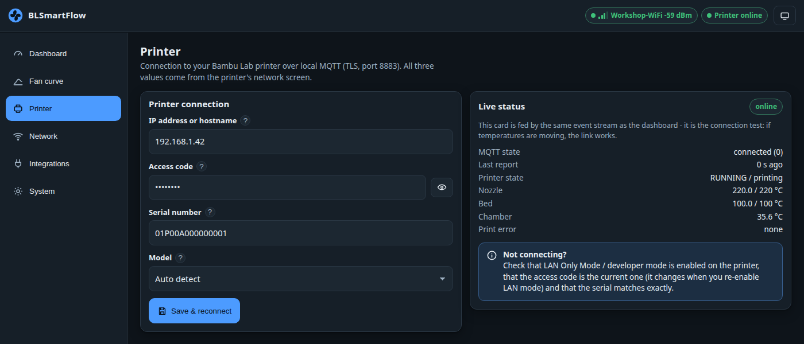

# Connecting the printer

The **printer link** is a TLS MQTT session from the device straight to your printer on your own
network. It is how BLSmartFlow learns the temperatures, the print phase, the door state and what
filament is loaded.

## Enter the three values

1. Open the UI and go to the **Printer** page.
2. Enter the **IP address**, the **access code** (exactly 8 characters) and the **serial number**
   you collected in [What you need](what-you-need.md).
3. Pick the **model**:
    - ***Auto detect*** is right for most setups. It asks the printer for a full status refresh every
      10 minutes.
    - ***P1P / P1S*** and ***A1 / A1 mini*** raise that to every 5 minutes, because those models only
      send *changes* and a fresh device would otherwise wait a long time for a complete picture.
    - ***X1*** and ***H2D*** never need it — they push complete reports themselves.
4. Press **Save & reconnect**. No reboot: the MQTT client restarts immediately.

/// caption
The *Live status* card is the connection test. If the temperatures move, the link works.
///

## Verify it

The **Live status** card on the right is the test. Within a few seconds you should see:

- **MQTT state** → `connected (0)`
- **Last report** counting in seconds, not stuck
- **Nozzle / Bed** showing real numbers with their targets
- **Printer state** showing something like `IDLE / idle` or `RUNNING / printing`

Then open the [Dashboard](../using/dashboard.md): the *Printer online* badge should be green, the
temperature tiles populated and a print-phase chip visible on the *Print job* card.

!!! tip "Open and close the front door once"
    While you are at the printer, open the front door and shut it again. BLSmartFlow does not trust
    the door bit until it has seen it *change*, because on some X1C units the switch never reports a
    closed door. One open/close proves the switch and turns the door rule live.
    → [Door not reported](../troubleshooting/door-not-reported.md)

## Not connecting? Work down this list

- [ ] Is **LAN Only Mode** — and **Developer Mode** — still enabled on the printer?
- [ ] Is the **access code the current one**? It changes whenever LAN Only Mode is toggled.
- [ ] Is it exactly **8 characters**? Any other length is refused with a clear error.
- [ ] Does the **serial** match exactly, including the leading zeros? A typo means the device
      subscribes to a topic that does not exist and simply never receives anything.
- [ ] Is the **IP** still correct? Check the router and set a fixed lease.
- [ ] Is the printer on the **same network** as the device — not a guest network or a separate VLAN?
- [ ] Does the *Live status* card say `unauthorized` or `bad_credentials`? The printer rejected the
      access code. After a rejection the device waits **60 seconds** before trying again, so give it
      a minute after you fix it.

More detail: [Printer link troubleshooting](../troubleshooting/printer-link.md) ·
[How the printer link works](../technical/printer-link.md)

---

**Next:** [Your first fan curve](first-fan-curve.md)
