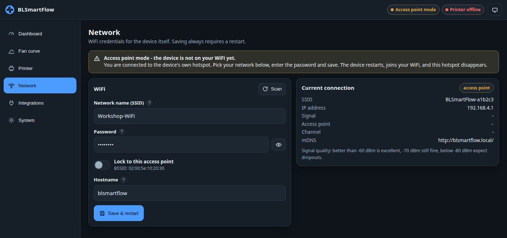
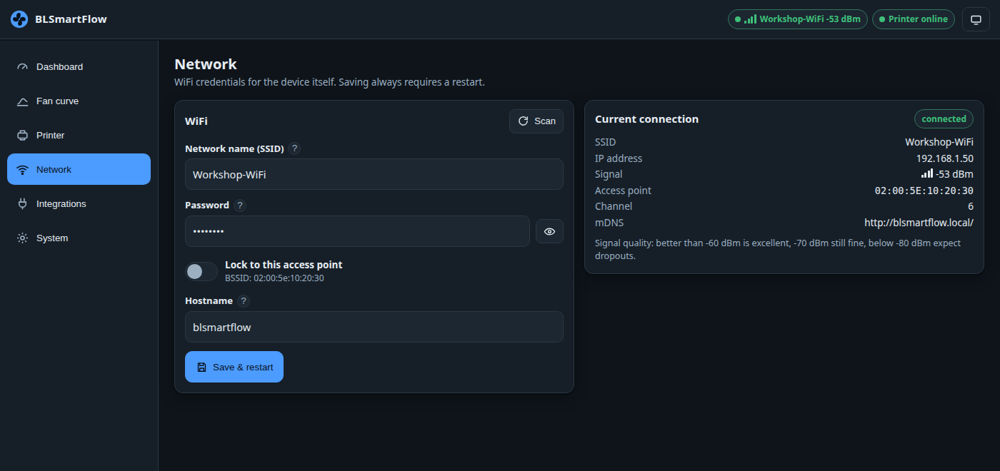

# First-time setup

A freshly flashed device has no settings. It raises its own open WiFi network — the **setup
network** — and runs a captive portal on it, so you can give it your WiFi credentials from a phone
or a laptop without any cable.

!!! note "This is step 2 of the install"
    Step 1 was [flashing over USB](flashing.md), which every 2.x install needs exactly once. If the
    device is already on your WiFi, you can skip straight to
    [connecting the printer](connect-printer.md).

## Join the setup network

1. **Power the module.** The status LED blinks once, pauses, blinks once — the setup-network pattern.
2. On a phone or laptop, open the WiFi list and join **`BLSmartFlow-xxxx`**, where `xxxx` is the last
   digits of the device's chip ID. It is an **open network**; there is no password.
3. The setup page should open by itself. On Android and Windows the notification says something like
   *"Sign in to network"*; on iOS and macOS a sheet titled with the network name pops up. Tap it if
   it does not open on its own.
4. If nothing appears, open a browser and go to **<http://192.168.4.1/>** — note `http://`, not
   `https://`.

/// caption
Setup mode. The banner explains where you are; *Current connection* shows the access point and
`192.168.4.1`.
///

## Enter your WiFi

5. Press **Scan** to list nearby 2.4 GHz networks and pick yours, or type the name by hand for a
   hidden network. The scan takes about three seconds.
6. Enter the WiFi password. Leave the hostname at `blsmartflow` unless you want to change it.
7. Press **Save & restart**.

The device restarts and joins your network.

8. **Reconnect your phone or laptop to your own WiFi.** You are still on the device's hotspot, which
   has no route to anything.
9. Open **<http://blsmartflow.local/>**. If that name does not resolve, look the device up in your
   router's client list and use its IP address instead.

/// caption
Once the device is on your network, the same page shows the live connection: SSID, IP address,
signal, channel and the mDNS name.
///

## Phone caveats

!!! warning "Phones like to leave a network with no internet"
    The setup network has no internet access, and modern phones abandon such networks automatically.

    - **Android** — when the *"network has no internet access"* prompt appears, choose **Stay
      connected** (some phones say *Yes*). If the phone keeps hopping away, switch mobile data off
      for the two minutes the setup takes.
    - **iOS / iPadOS** — use the login sheet that pops up when you join. Do **not** tap *Cancel*;
      that tells iOS to abandon the network. If you dismissed it, go to *Settings → Wi-Fi*, tap the
      network again, or open `http://192.168.4.1/` in Safari.
    - **Windows / macOS** — the "sign in" window is a stripped-down browser. If it misbehaves (blank
      page, missing controls), close it and use a normal browser at `http://192.168.4.1/`.

Some Android builds probe for a captive portal over HTTPS, which the device cannot answer. That is
why `http://192.168.4.1/` by hand is always the fallback. More detail:
[WiFi and the captive portal](../technical/wifi-and-captive-portal.md).

## When does the setup network appear?

- **Immediately at boot** when no WiFi credentials are stored.
- Otherwise only after **90 seconds of continuous failure** to reach the stored network.

While it is up, the device keeps trying your WiFi in the background. Once it succeeds, the setup
network stays alive for **5 more minutes** — so you are not cut off mid-page — and then closes on its
own.

!!! info "mDNS: `blsmartflow.local`"
    `http://blsmartflow.local/` works out of the box on macOS, iOS and most Linux desktops. Windows
    and some Android versions do not always resolve `.local` names. If it fails, use the IP address;
    it is shown on the *Network* page under *Current connection*, and in your router's client list.
    See [Web UI troubleshooting](../troubleshooting/web-ui.md).

## Installation checklist

!!! abstract "The complete install, in order"

    - [ ] **Printer prepared** — LAN Only Mode *and* Developer Mode enabled; IP address, 8-character
          access code and serial number written down.
          ([What you need](what-you-need.md))
    - [ ] **Flashed over USB** — merged `BLSmartflow_2.0.2.bin` at offset `0x0`, with erase enabled.
          ([Flashing](flashing.md))
    - [ ] **Boot verified** — serial log shows the version banner and `setup AP … at 192.168.4.1`;
          the status LED blinks once per pause.
    - [ ] **Joined `BLSmartFlow-xxxx`** and reached the portal (or `http://192.168.4.1/` by hand).
    - [ ] **WiFi saved** — network picked from the scan, password entered, *Save & restart* pressed.
    - [ ] **Reconnected** your phone or laptop to your own network.
    - [ ] **UI reachable** at `http://blsmartflow.local/` or the device's IP.
    - [ ] **Printer added** — IP, access code and serial on the *Printer* page, *Save & reconnect*.
          ([Connecting the printer](connect-printer.md))
    - [ ] **Verified on the dashboard** — *Printer online*, temperatures moving, a print phase chip.
          ([Dashboard](../using/dashboard.md))
    - [ ] **Fan mode chosen** — a curve, or the chamber thermostat.
          ([Your first fan curve](first-fan-curve.md))
    - [ ] *Optional:* **Home Assistant / MQTT** configured.
          ([Home Assistant](../using/home-assistant.md))
    - [ ] *Optional:* **Backup downloaded** from the System page, and a UI password set.
          ([Backup and security](../using/backup-security.md))

---

**Next:** [Connecting the printer](connect-printer.md)

Trouble getting on WiFi? → [WiFi troubleshooting](../troubleshooting/wifi.md)
