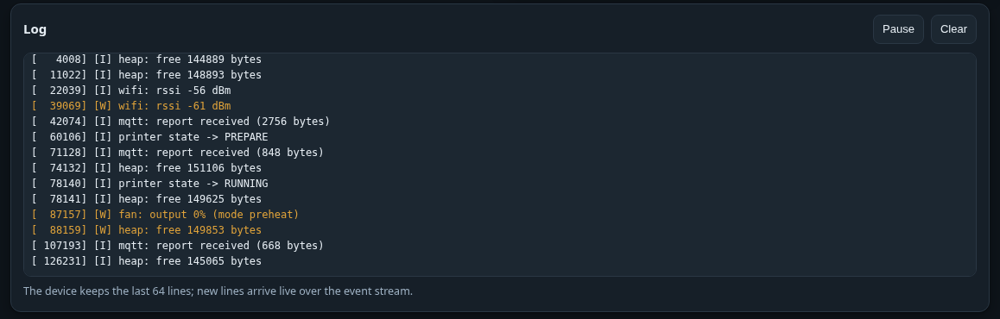

# Troubleshooting: the printer link

Start on the **Printer** page. The *Live status* card tells you which of the three failure modes you
are in.

## MQTT state `unauthorized` or `bad_credentials`

**Why.** The printer rejected the access code.

**Fix.** Re-read the code from the printer's *Settings → Network → LAN Only Mode* screen. It changes
every time LAN Only Mode is switched off and on.

!!! note "Then wait a minute"
    After a rejection the device backs straight off to **60 seconds** between attempts, because
    retrying a rejected password cannot help. Give it a minute after you fix it, or press
    *Save & reconnect* to force an immediate attempt.

## "access code must be exactly 8 characters"

The LAN access code is always 8 characters. Any other length is refused outright rather than sent to
the printer. Re-read it from the printer's screen.

## MQTT connects, but no data ever arrives

**Why.** Almost always a **wrong serial number**. The serial forms the MQTT topic
`device/<serial>/report`, so a single wrong character means the device subscribes to a topic nothing
publishes to — and the broker happily accepts the subscription.

**Fix.** Check the serial character by character, including leading zeros. Letters are upper-cased for
you; digits and letters that look alike (`0`/`O`, `1`/`I`) are the usual culprits.

## `connect failed` / never connects

Work down this list:

- [ ] **LAN Only Mode** *and* **Developer Mode** enabled on the printer?
- [ ] The **IP** still correct? Set a fixed DHCP lease so it stops moving.
- [ ] Printer and device on the **same network** — not a guest network or a separate VLAN?
- [ ] Is the printer actually **awake**? A sleeping printer does not serve MQTT.

The status LED shows **3 blinks** for "WiFi up, printer MQTT down".

## Temperatures show `--`, the fan badge says "Stale data"

**Why.** No report has arrived for longer than the **stale timeout** (120 s by default). The printer
is off, or the serial or IP is wrong.

**Fix.** Check the link. Meanwhile the failsafe you configured under *Safety & gating* is driving the
fan: hold, off or a fixed speed.

Note that staleness is judged **by data age**, not by the socket, so a brief reconnect does not flip
you into the failsafe.

## Chamber temperature stays empty

**Why.** Only **X1- and H2D-style** printers have a chamber sensor.

**Fix.** Use *Nozzle*, *Bed* or *Hottest of all* as the curve source. If you selected *Chamber
thermostat*, the device falls back to the curve and the mode chip says **Automatic** — that is the
designed behaviour, not a fault.

!!! info "X1 owners: it may be a firmware-version thing"
    Current X1C firmware no longer sends the old `chamber_temper` field. BLSmartFlow reads the packed
    `device.ctc` block instead, so it works on both — but a third-party MQTT tool that only knows
    `chamber_temper` will show nothing.
    → [Field decoding](../technical/printer-link.md#field-decoding)

## The link drops when I change a setting

Only `ip`, `accessCode` and `serial` tear the session down. `staleSec` and the MQTT-dump switch are
picked up in place. If the link drops on an unrelated save, the printer or the network is at fault,
not the device.

## Digging deeper

Turn on **Dump printer MQTT** in *System → Diagnostics*. Every *filtered* report is printed to the
log, so you can see exactly what the printer is sending and what survives filtering. It is very
noisy — turn it off again afterwards.

---

Related: [Connecting the printer](../getting-started/connect-printer.md) ·
[The printer link](../technical/printer-link.md)
