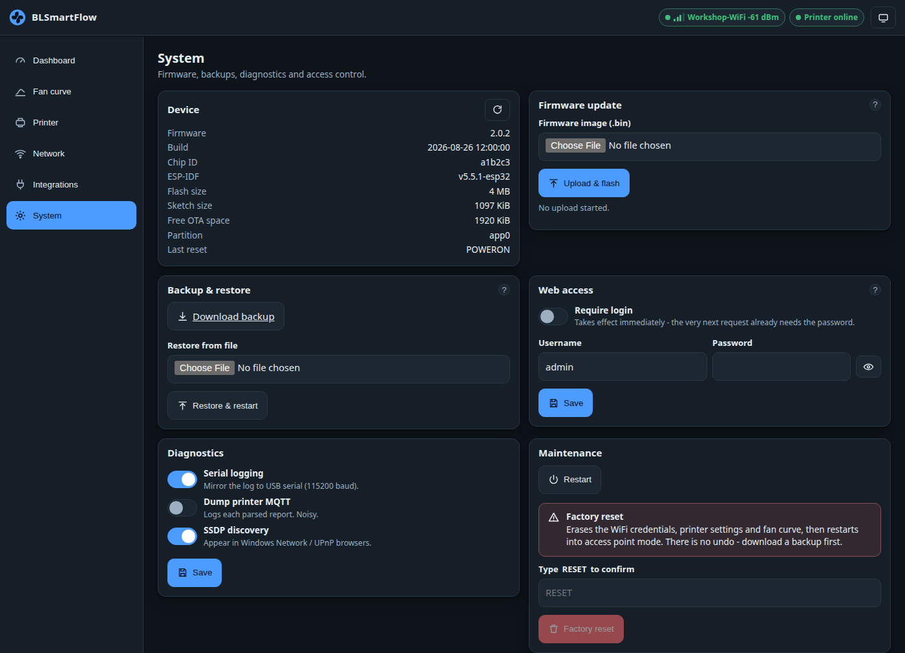

# Backup, restore and security

Everything on this page lives on the **System** page of the UI.

## Backup

**Download backup** saves the whole configuration as a JSON file — WiFi, printer details, the fan
curve, every filament override, the MQTT settings and the learned cooling-rate table.

!!! danger "The backup contains secrets in plain text"
    Your **WiFi password** and the **printer access code** are in the file, unmasked, along with the
    broker password and the UI password. Keep it somewhere safe. Do not paste it into a forum post or
    an issue.

Take one before a firmware update, and after you have finished tuning.

## Restore

**Restore from file** uploads such a file, replaces the **entire** configuration with it and restarts.

Two things worth knowing:

- Keys the file does not contain fall back to their **defaults**, not to your current values. Restore
  a complete backup, not a fragment.
- A backup that has no WiFi network name in it is **refused**, because restoring it would strand the
  device with no way back on to your network.

A backup taken from the UI carries `********` in place of the secrets; on restore those are seeded
from the running configuration, so the stored WiFi password and access code survive rather than being
wiped.

## Restart

**Restart** reboots the device. The fan outputs drop to 0 % for a few seconds while it comes back.

## Factory reset

**Factory reset** wipes the configuration and restarts into
[setup-network mode](../getting-started/first-setup.md). Everything goes: WiFi, printer details,
curve, filament overrides, MQTT settings, learned cooling rates.

Type `RESET` in capitals to unlock the button.

## A password for the UI

**Web access → Require login** turns on HTTP basic authentication for the UI **and every API route**.
Set a username (default `admin`) and a password; it takes effect on the very next request.

!!! warning "Basic auth is not encryption"
    There is no TLS on the device's own web server. A password keeps casual visitors out of a trusted
    LAN — that is all it does. Anyone who can watch your network traffic can read it.

    Login cannot be armed with an empty password: the device turns the switch back off.

!!! info "The setup network is always open — deliberately"
    Requests that arrive over the **setup network** are never asked for a password. That is a way
    back in when WiFi is broken and you cannot reach the device any other way.

    The trade is real and worth stating plainly: **anyone within radio range of a device that is in
    setup mode can read its backup — secrets included — and reflash it.** The setup network is only
    up when the device has no credentials, or has been unable to reach WiFi for 90 seconds.
    → [Security notes](../technical/wifi-and-captive-portal.md#security)

### Forgotten the password?

Two ways back:

1. Reach the device on its **setup network**, where no password is asked. (Only available when the
   device cannot reach your WiFi.)
2. Send `{"cmd":"factoryreset"}` over **USB serial** at 115200 baud.

→ [Recovery](../troubleshooting/recovery.md)

## Diagnostics

| Switch | What it does |
|---|---|
| **Serial logging** | Mirror the log to USB serial at 115200 baud. Turn it off to keep the serial port quiet for provisioning. |
| **Dump printer MQTT** | Print every *filtered* printer report to the log. Very noisy — enable it only while diagnosing missing temperatures, then turn it off. |
| **SSDP discovery** | Announce the device over UPnP/SSDP so it appears in Windows' Network view. Costs a little RAM and some multicast traffic. |

## The log viewer

The device keeps the last **64 lines** in a ring buffer; new lines arrive live over the event stream.
**Pause** stops appending so you can read or copy; **Clear** empties the view (the device's own buffer
is untouched).

A line reads `[   1234] [W] wifi: rssi -61 dBm` — uptime in milliseconds, level (`I`/`W`/`E`), then
the message. Longer messages are truncated at 120 bytes and older lines are lost.
