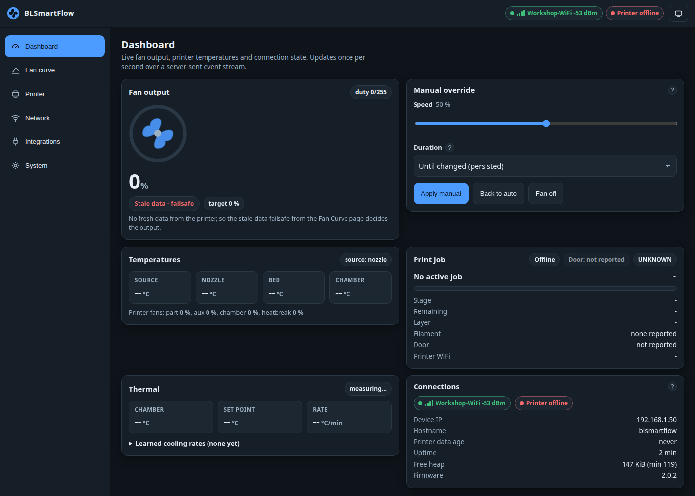
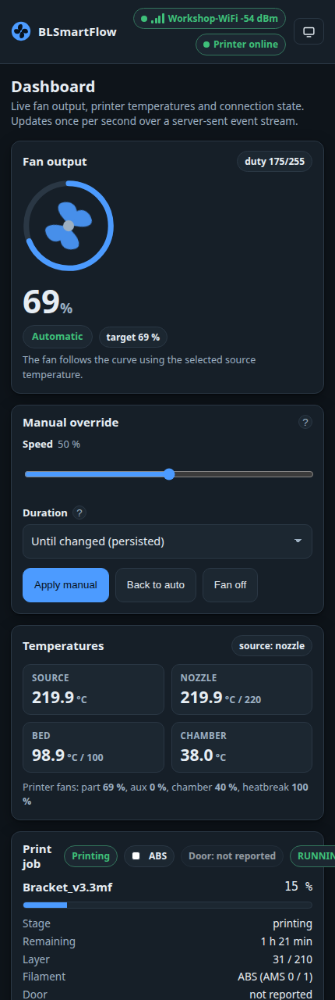
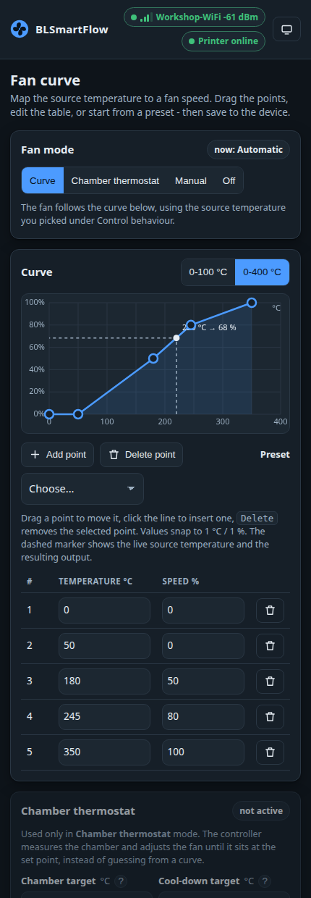
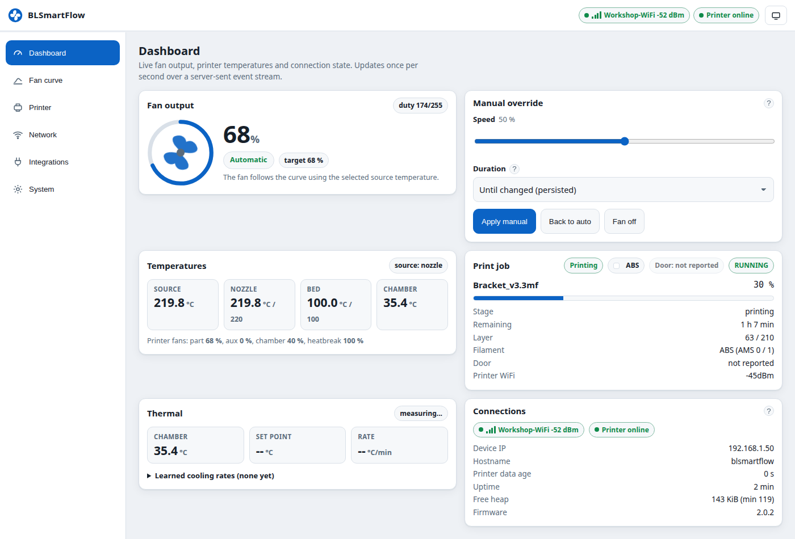

# The dashboard

The dashboard is the device's home page. It updates **once per second** over a server-sent event
stream, falling back to polling every two seconds where the stream is not available.

/// caption
The dashboard during a print, with the fan following the curve at 68 %.
///

## Fan output

The gauge shows what the fan is **actually** doing.

| Element | Meaning |
|---|---|
| The big percentage | The output being driven right now, 0–100 %. |
| `duty n/255` | The 8-bit value written to the pin. With *Invert PWM* on it is already inverted, so 0 % reports `duty 255`. |
| The coloured badge | The **effective mode** — see below. |
| `target n %` | What the active mode is *asking* for. The output moves towards it at the configured ramp rate, and minimum speed or kick-start can make the two differ for a moment. |

### Effective mode

This is the single most useful field on the page: what the controller is doing this second, which can
differ from the mode you picked.

| Badge | Meaning |
|---|---|
| **Automatic** | Following the curve. |
| **Chamber thermostat** | The PI controller is holding the chamber target. |
| **Cool-down** | The post-print window: holding the cool-down target, or running the curve out. |
| **Manual** | A manual override is in force. |
| **Off** | Both outputs held at 0 %. |
| **Preheating** | The preheat rule has taken over — the printer is still coming up to temperature. |
| **Door open** | The door rule has taken over. |
| **Stale data – failsafe** | No fresh printer report; the failsafe you configured is driving the fan. |
| **Idle** | The idle gate: nothing to cool and no set point. |

The order these are evaluated in is documented in [the control loop](../technical/control-loop.md).

## Manual override

Takes the fan away from the curve for a while, or permanently. See
[Manual override](manual-override.md).

## Temperatures

Nozzle, bed and chamber as the printer reports them, with their targets where the printer sends one,
plus a **Source** tile showing the temperature the curve is actually reading.

Below them, the **printer's own fans**: part, aux, chamber and heatbreak, as percentages. These are
the printer's fans, not yours.

!!! info "`--` means *unknown*, not zero"
    An empty reading is genuinely unknown — the printer has not reported it. A P1 or A1 never
    reports a chamber temperature; a printer that has gone quiet reports nothing at all.

## Print job

The job name, a progress bar, and the counters the printer sends: stage, remaining time, layer,
filament, door, printer WiFi.

Three chips sit in the card header:

| Chip | What it tells you |
|---|---|
| **Phase** | *Idle*, *Preheating*, *Printing*, *Paused*, *Cooling*, *Finished – cooling*, *Failed*, *Offline*. This — not the raw printer state — is what the fan rules act on. |
| **Filament** | The material in the active tray, with its colour. Hover it for the effective targets. |
| **Door** | *Door open*, *Door closed*, or a muted **Door: not reported**. |

!!! warning "Door: not reported"
    The device does not trust the door bit until it has seen it **change**, because on some X1C units
    the closed door never presses the switch. Open and close the front door once to prove it. The
    **top lid has no sensor at all** and never shows here.
    → [Door not reported](../troubleshooting/door-not-reported.md)

## Thermal

Chamber temperature, the thermostat **set point** (only in chamber mode), and the current **rate** of
change in °C per minute — negative while cooling.

Behind *Learned cooling rates* is a small table of `k` values. Nothing there changes how the fan
behaves; it is measurement, so you can answer "if I set the fan to 50 % and shut the door, how long
until I can open the printer?".
→ [Cooling-rate learning](../technical/cooling-rate-learning.md)

## Connections

The three links the device maintains, and the device's own vital signs:

- **WiFi** — SSID and signal strength.
- **Printer** — online / offline. *Online* means the MQTT session is up **and** the last report is
  younger than the stale timeout.
- **External broker** — only when you have enabled it.
- Device IP, hostname, printer data age, uptime, free heap and firmware version.

## Offline and stale

/// caption
The printer is not reporting. The stale-data failsafe decides the output — here *Switch off*.
///

When no report has arrived for longer than the **stale timeout** (120 s by default), temperatures
show `--`, the effective mode becomes **Stale data – failsafe**, and the fan does whatever you
configured under *Safety & gating*: hold the last speed, switch off, or run at a fixed speed.

Staleness is judged **by data age only**, not by the MQTT socket state — so a brief reconnect does not
yank the fan to the failsafe while the last reading is still seconds old.

## On a phone

At phone widths the cards stack into a single column and the navigation becomes a bottom tab bar.

## Light and dark

The UI follows your browser's colour scheme, and the button in the top right cycles
system → light → dark. The choice is stored in that browser only, never on the device.

