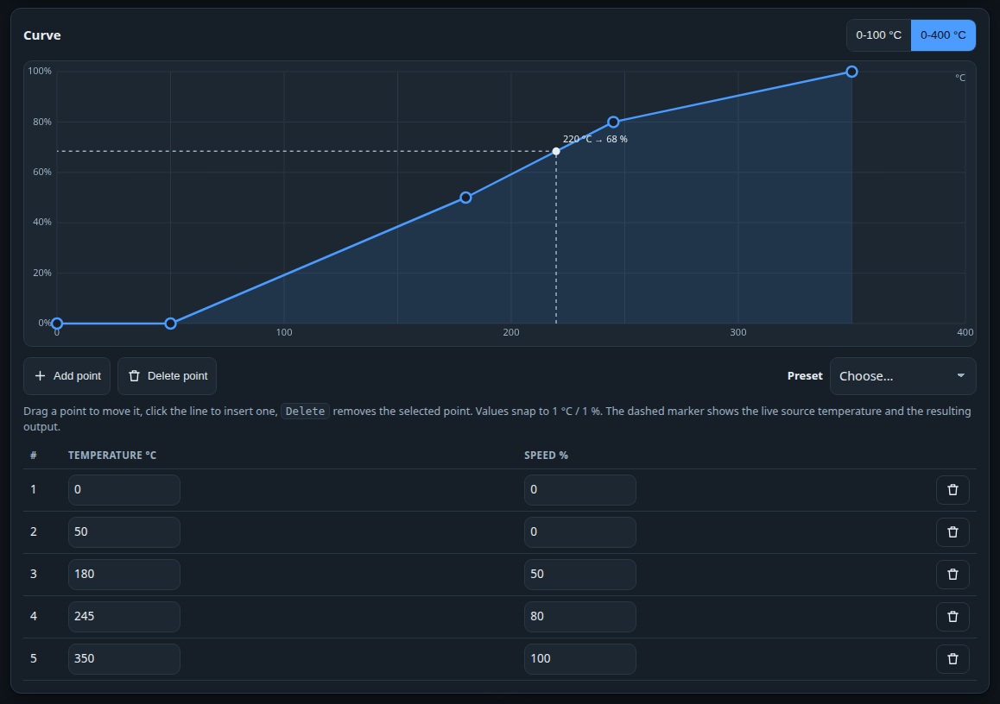
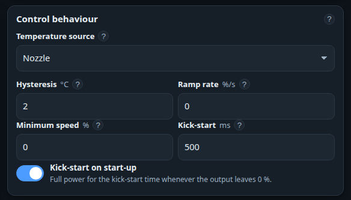
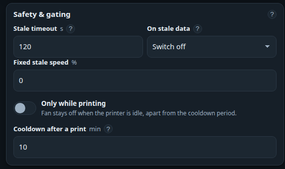

# The fan curve editor

The **Fan curve** page maps one printer temperature — the *source* — to a fan speed.

/// caption
The dashed marker is live: it shows the source temperature right now and the output it produces.
///

## Editing points

- **Drag** a point with the mouse or a finger. Values snap to 1 °C and 1 %. A point cannot pass its
  neighbours.
- **Click or tap the line** to insert a point there, or press **Add point** to split the widest gap.
- **Delete point** — or the ++delete++ / ++backspace++ key — removes the selected point.
- The **table** below the graph is the same curve. Type exact numbers there if you prefer.
- A curve has **at least 2 and at most 16 points**. Temperatures run 0–400 °C, speeds 0–100 %.

The **0-100 °C / 0-400 °C** buttons only zoom the temperature axis. They change nothing on the
device — use 0-100 °C for chamber curves, where everything interesting sits below 60 °C.

!!! note "Nothing is saved until you press Save"
    Edits are staged in the bar at the bottom of the page. **Save** writes them to the device;
    **Revert** throws them away and reloads what is stored.

## Presets

| Preset | What it does |
|---|---|
| **Quiet** | Keeps the fan off until 200 °C and rises gently — the quietest option. |
| **Balanced** | The factory curve: off below 50 °C, 50 % at 180 °C, 80 % at 245 °C, 100 % at 350 °C. Good for PLA/PETG. |
| **Aggressive** | Starts at 35 °C and reaches 100 % by 220 °C — maximum cooling. |
| **Chamber-ABS** | A 0–80 °C curve meant for chamber-temperature control. |

A preset only fills the editor. You still have to press **Save**.

## Choosing the source

| Source | Use it when |
|---|---|
| **Nozzle** | The default. The fan cools something that tracks the hotend — part cooling, a hotend duct, electronics that heat up with the print. |
| **Bed** | The fan reacts to the heated bed. |
| **Chamber** | **Enclosure venting** — keeping the enclosure at a temperature. Pair it with the *Chamber-ABS* preset, because all the interesting values are below 60 °C. Only X1- and H2D-style printers report a chamber temperature; on other models it stays empty and the curve gets no reading. |
| **Hottest of all** | The maximum of nozzle, bed and chamber, ignoring the ones that are unknown. A general-purpose "something in there is hot" fan. |

## Control behaviour

| Setting | Plain words | Range / default |
|---|---|---|
| **Hysteresis** | "Do not react to tiny wobbles." The curve is only re-evaluated once the source temperature has moved by at least this much. 1–3 °C stops the fan hunting around a curve point; 0 turns the filter off. | 0–50 °C, default 2 |
| **Ramp rate** | "How fast may the speed change." 0 jumps straight to the new value. 20 %/s takes five seconds to go from stopped to full — quieter, and kinder to the bearings. | 0–1000 %/s, default 0 |
| **Minimum speed** | "Below this, just stop." Many fans buzz or stall instead of turning at very low duty. Set it just above the lowest speed at which your fan still spins reliably — often 15–25 % on small fans. Anything below it is output as 0 %. | 0–100 %, default 0 |
| **Kick-start** | "Give it a shove." Leaving standstill, the fan runs at 100 % for a short pulse so it breaks away instead of humming. | 0–5000 ms, default 500; 300–800 is the useful range |

!!! info "The kick pulse cannot stutter"
    It is only armed when the fan has genuinely been stopped for a couple of seconds, so a curve that
    dips briefly through zero cannot leave the fan pulsing.

## Safety and gating

| Setting | What it means | Range / default |
|---|---|---|
| **Stale after** | If no report arrives from the printer for this long, the temperature is treated as unusable. | 10–3600 s, default 120 |
| **When data is stale** | **Off** stops the fan (safest for part cooling) · **Hold** keeps the last speed (good when the fan cools electronics) · **Fixed** runs at the speed below (good for chamber venting you never want to stop). | default *Off* |
| **Only while printing** | The curve runs only while a job is actually going — preheating, printing or paused. Outside a print the fan switches off once the cool-down has elapsed. | default off |
| **Cooldown** | How long the curve keeps running after the print finishes, so a hot nozzle or chamber is still cooled. Only used when *Only while printing* is on. The window also ends early once the chamber reaches the **cool-down target** — whichever comes first. | 0–1440 min, default 10 |

## Outputs

Output 1 (GPIO 17) and output 2 (GPIO 16) always carry the **same duty cycle**; you can disable
either one, and a disabled output is held at 0 %.

- **PWM frequency** defaults to **25000 Hz**, which is above hearing and silent on good 4-pin and
  2-pin fans. Some cheap fans and MOSFET boards prefer 1000–8000 Hz. Range 500–40000 Hz.
- **Invert PWM** is for driver boards that expect an active-low signal. Turn it on **only** if your
  fan runs full speed when the UI says 0 %.

Fan whining, stalling or hunting? → [Fan behaviour](../troubleshooting/fan-behaviour.md)

## On a phone

Everything above works on a phone, in a single column, with the graph drag-editable by finger.

---

The exact evaluation order — hysteresis, clamp, ramp, minimum speed, kick, invert — is documented in
[the control loop](../technical/control-loop.md). The curve endpoints are
[`GET`/`PUT /api/curve`](../technical/rest-api.md#fan-curve).
