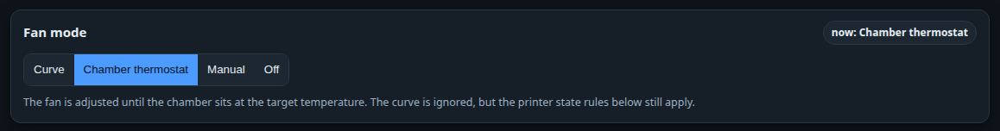
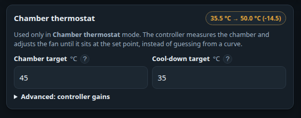
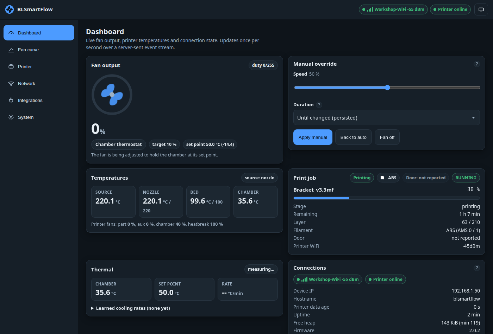

# Fan modes

The **Fan mode** card at the top of the *Fan curve* page decides what drives the fan at all. There
are four modes, and the choice applies the moment you click it — it does not wait in the save bar.

| Mode | What it does |
|---|---|
| **Curve** | The fan follows the [fan curve](fan-curve-editor.md), using the source temperature you picked. |
| **Chamber thermostat** | The fan is adjusted until the chamber sits at a temperature you set. The curve is ignored. |
| **Manual** | One fixed speed from the dashboard. Every temperature is ignored. |
| **Off** | Both outputs held at 0 %, and nothing is evaluated. |

!!! tip "The badge is not the mode"
    The `now: …` badge in the corner shows the **effective mode** — what the controller is *actually*
    doing. A door rule, a preheat rule, the stale-data failsafe or the idle gate all take priority
    over the mode you picked. That is by design.

## When to use which

### Curve

Use it when the fan's job is tied to **how hot something is getting**: part cooling, a hotend duct,
electronics that warm up with the print, or venting by nozzle temperature.

A curve is *feed-forward*. It reacts to the heat being produced, not to the air that is already warm,
so it responds instantly and never overshoots. It also works on every printer, because it can read
the nozzle or the bed.

### Chamber thermostat

Use it when the fan's job is to **hold the enclosure at a temperature**.

A curve can only guess. You tell it "50 % at 45 °C" and hope that is enough airflow — but the right
number depends on the room, the filament, the print and where the fan is mounted, and it changes as
the print goes on. A thermostat does not guess: it measures the chamber, compares it with the
temperature you asked for, and adjusts until it gets there.

That matters most for **ABS and ASA**, where the chamber temperature is the difference between a part
that holds together and one that splits along the layer lines — and where too *little* airflow slowly
bakes the electronics and the filament sitting in the AMS.

You set two temperatures:

| Setting | What it does | Typical |
|---|---|---|
| **Chamber target** | Held while a print is running. | 45–50 °C for ABS/ASA, 35–40 °C for PETG, as cool as the room for PLA |
| **Cool-down target** | After the print, the fan keeps going until the chamber has dropped this far. | 35 °C — cool enough to open the printer and lift the part off |

The cool-down target does double duty: in plain **Curve** mode with *Only while printing* switched on,
it also ends the cool-down window early, so the fan stops as soon as the chamber is actually cold
instead of running out its full timer.

!!! warning "Needs a chamber sensor"
    Chamber thermostat mode needs a printer that reports a chamber temperature — X1- and H2D-style
    machines. On a printer without one, the device quietly falls back to the curve rather than
    running blind: the mode chip says **Automatic** even though *Chamber thermostat* is selected.

/// caption
While the thermostat runs, the *Fan output* and *Thermal* cards gain a set point:
`set point 45.0 °C (+1.8)` means the chamber is 1.8 °C too hot and the fan is being asked for more.
///

#### Advanced: Kp and Ki

Hidden behind *Advanced: controller gains*, and best left alone. Open them only if the fan **hunts**
(surges up and down instead of settling) or takes **far too long** to react.

| Gain | Meaning | If the fan hunts | If it reacts too slowly |
|---|---|---|---|
| **Kp** (%/°C) | How much fan you get per degree above target. At the default 8, being 5 °C too hot asks for 40 % fan. | Lower it | Raise it |
| **Ki** (%/°C·s) | Slowly builds output while a small error refuses to go away — it removes the last degree. | Lower it | Raise it a little |

**Update period** is how often the thermostat recalculates (5 s by default). An enclosure takes
minutes to respond, so running faster gains nothing and only invites the fan to chase sensor noise.

Two safeguards need no configuration: the accumulated correction is capped so it can never demand
more than full speed, and it is **frozen while the door is open or the fan is already flat out**.
Without that freeze, holding the door open for two minutes would leave the fan roaring for several
minutes after you shut it again.

The maths, and why it is built that way: [Chamber thermostat](../technical/chamber-thermostat.md).

### Manual

One fixed speed, no temperatures involved. Useful while you work out what your fan can do, or as a
permanent setting for a quiet trickle of ventilation. The mode is **persisted**, so a device left in
manual comes back in manual after a power cut.

You can also set a manual speed *temporarily* from the dashboard, with a timer that returns the fan
to the curve on its own — see [Manual override](manual-override.md).

### Off

Both outputs held at 0 %. Nothing here changes the fan again until you pick another mode. The printer
state rules and the ventilation floor are skipped entirely.

## What overrides what

Whatever mode you pick, these decide the output first — in this order:

1. **Off** and **Manual** win outright.
2. **Stale data** — no fresh report from the printer.
3. **Door open** — if the rule is enabled and the printer has proved its door switch.
4. **Preheating** — if the rule is enabled.
5. Then the mode you chose: thermostat, cool-down or curve.

The full table, with the exact conditions: [Control loop](../technical/control-loop.md).
