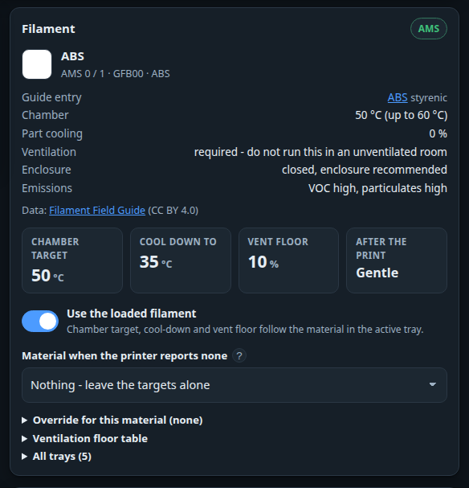
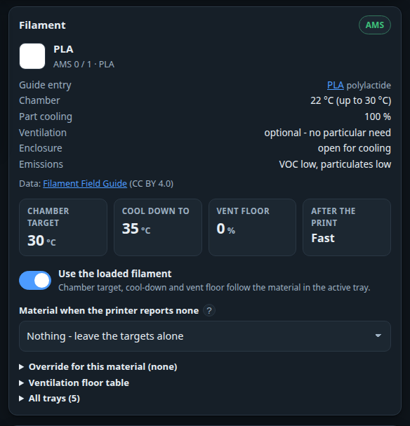
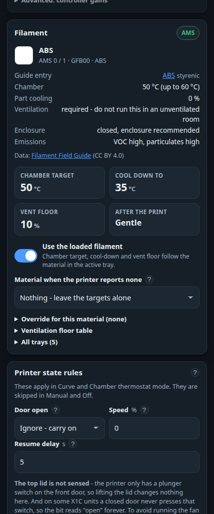

# Filament-aware cooling

The right chamber temperature is not a property of your printer. It is a property of the plastic in
it. PLA wants the enclosure as cool as it can get; ABS wants it at 50 °C; ASA wants a little warmer
still. Setting one number and leaving it there means being wrong for most of what you print.

Your printer already knows what is loaded — the AMS reads it off the spool's tag, and Bambu filament
carries a material code. BLSmartFlow reads that, looks the material up in a table baked into the
firmware, and moves its own targets to suit. **It is on by default and needs no setup.**

/// caption
The same card with ABS loaded, and with PLA. The four tiles are what the fan controller actually
uses — and they are entirely different numbers for the two materials.
///

## What is detected

Open the **Fan curve** page and look at the **Filament** card.

- **The active tray** — colour, material, the Bambu id (`GFB00`) and which AMS slot it came from. A
  spool on the external holder shows as *External*. A multi-material print moves the card as the
  printer swaps trays, and the targets move with it.
- **The matched entry** in the [Filament Field Guide](https://pwsh.github.io/filament-field-guide/):
  the ambient temperature band, the recommended part-cooling setting, how badly the fumes want
  ventilating and what the material gives off. The name links straight to the guide's page for that
  material.
- **All trays** — the whole AMS, at the bottom of the card, so you can see what the printer thinks is
  loaded everywhere.

Carbon- and glass-filled grades fall back to the plain polymer when the guide has no separate entry:
`PA-GF` is shown as PA-GF but cooled like PA — the fibre changes the stiffness, not the temperature
the enclosure wants. Support filaments take the profile of the material they are printed *next to*:
Support For PLA is cooled like PLA.

If the guide has never heard of your material the card says so and nothing changes; your own settings
stand.

## What changes

Four numbers, shown as tiles in the middle of the card:

| Tile | What it means |
|---|---|
| **Chamber target** | The temperature *Chamber thermostat* mode holds while printing. PLA 30 °C, PETG 35 °C, ABS 50 °C, ASA 55 °C, PC 55 °C. For the materials that want cooling this is a **ceiling** — "do not let it get warmer than this" — not a temperature to reach. |
| **Cool down to** | Where the chamber is emptied down to after the print. Unchanged from your setting unless you override it. |
| **Vent floor** | A minimum fan speed while a print is running. See the caveat below. |
| **After the print** | *Fast* runs the cool-down normally. *Gentle* is used for materials the guide prints with the part fan off: the fan stays off until the chamber is 10 °C below the print target and then runs at half speed at most. Blasting cold air at a hot ABS part is how it splits. |

These feed the [chamber thermostat](fan-modes.md#chamber-thermostat) and the cool-down window. In
plain **Curve** mode the curve still decides the speed — the filament only ends the cool-down at the
right temperature and holds the vent floor.

To switch the whole thing off, turn off **Use the loaded filament**. The card still shows what is
loaded; the fan goes back to the numbers in the *Chamber thermostat* card, whatever is in the AMS.

## The spool that vanishes at the end of a print

When the AMS unloads at the end of a job, the printer reports that **no tray is active** — and the
material that was printing disappears from view at exactly the moment its cool-down rule matters
most.

So the device **remembers** it. Through the *Finished – cooling*, *Cooling* and *Idle* phases the
last known material stays in force: the card and the dashboard chip show it with a **last print**
badge, the status document reports `filament.source: "last"`, and the gentle-versus-fast cool-down
rule still follows that material.

The memory is cleared when a new tray is loaded, or when a new job starts without one.

## When the printer reports nothing

An external spool with no tag, or a P1 with no AMS, tells the device nothing at all. Pick your usual
material under **Material when the printer reports none** and it is used whenever there is nothing
better. A tray the printer *does* report always wins over it.

## Overriding a material

Guides are opinions. If your ABS wants 48 °C in your room with your fan, say so.

1. Open **Override for this material**.
2. Check that *Applies to* names the right material — it defaults to the one currently loaded.
3. Fill in only the fields you want to change. A field left empty means "use the guide's figure".
4. Press **Apply rule**, then **Save changes** at the bottom of the page to write it to the device.

*Applies to* also offers **Every material**, a catch-all for things like "never cool below 30 °C". A
material's own rule always beats the catch-all. You can keep **twelve** rules; the table under the
editor lists them with a Remove button each.

!!! note
    With *Use the loaded filament* switched off, overrides are not applied either. You have said
    "do not let the filament move my set points", and a vent floor pushed by a material would be
    exactly that.

## The ventilation floor, and why it is nearly zero

ABS and ASA give off styrene and a great many ultrafine particles. The guide marks them *ventilation
required*, and the honest answer to that is an exhaust that goes through a filter or out of the room.

!!! warning "Bambu deliberately keeps the exhaust fan off for these materials"
    And they are right to: the chamber heat is what stops ABS warping and splitting, and an exhaust
    fan throws it away. That is the tension this setting sits in — the material that most wants
    ventilating is the one that least wants its chamber emptied.

So the defaults are **0 %** for everything except *ventilation required*, which gets **10 %** — a
trickle that keeps the air moving without emptying the chamber. Change it only if you know where your
air is going:

| Your fan | Reasonable setting |
|---|---|
| Ducted outside, or through a carbon filter | Raising *required* to 20–30 % is reasonable |
| Just stirring the air in the room | Leave it low. It is not cleaning anything, and it is costing you chamber temperature |
| You only ever print PLA and PETG | All three rows can stay at 0 |

The floor applies **only while a print is running**, and it never overrides the door rule, the preheat
rule or the stale-data failsafe. Those exist to stop the fan for a reason.

## On the dashboard

The **Print job** card gets a chip with the material's colour and name next to the phase chip, and a
*Filament* row naming the slot it came from. Hovering the chip shows the effective targets.

## On a phone

## Where the data comes from

The material table is the [Filament Field Guide](https://github.com/pwsh/filament-field-guide) by
pwsh, used under the **Creative Commons Attribution 4.0** licence
([CC BY 4.0](https://creativecommons.org/licenses/by/4.0/)). It ships **inside the firmware** — about
90 materials in roughly 8 KB — so nothing is fetched from the internet and the card works in setup
mode with no network at all. Every place the UI shows one of its numbers carries the credit and a
link back.

---

How the matching actually works — tray encodings, normalisation, the Bambu id prefixes:
[Filament matching](../technical/filament-matching.md).
