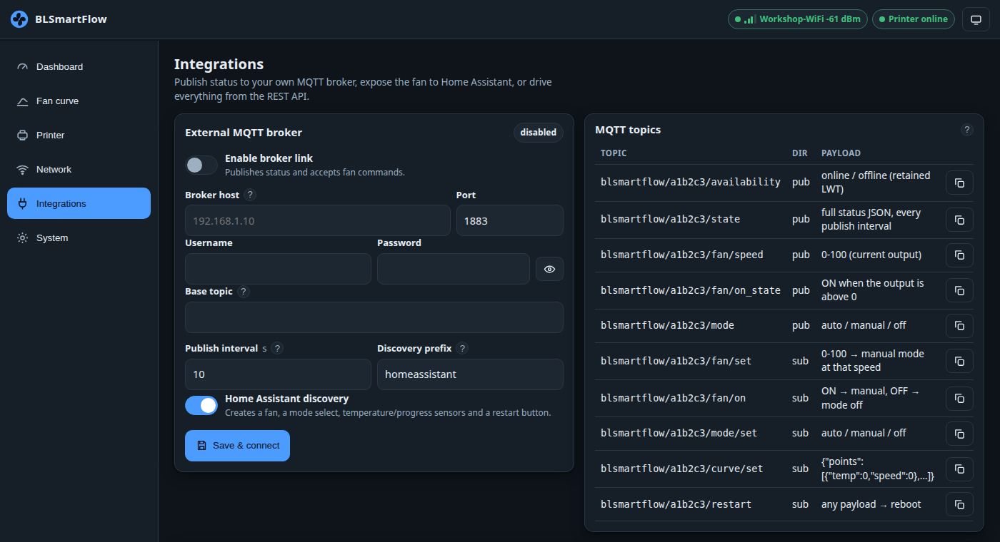

# Home Assistant in five minutes

The device can talk to **your own MQTT broker** — the Mosquitto add-on, for example — and announce
itself to Home Assistant automatically.

!!! info "This is a second, separate MQTT link"
    It has nothing to do with the [printer link](../technical/printer-link.md). The printer link is
    TLS to your printer; this one is plain TCP to your broker.



## Setup

1. Go to **Integrations → External MQTT broker**.
2. Switch **Enable broker link** on and fill in the broker **host** (e.g. `homeassistant.local` or
   its IP) and **port** (`1883`). Add a **username / password** if your broker requires one.
3. Leave **Base topic** empty unless you want a custom prefix. Empty means
   `blsmartflow/<chipid>`, which is unique per device.
4. Leave **Home Assistant discovery** on and the **discovery prefix** at `homeassistant` — change it
   only if you changed it in the HA MQTT integration.
5. Press **Save & connect**. The badge on the card turns green when the broker accepts the
   connection.
6. In Home Assistant, open *Settings → Devices & services → MQTT*. A device called
   **BLSmartFlow &lt;chipid&gt;** appears within a few seconds.

!!! warning "Plain TCP, no TLS"
    Broker credentials cross your LAN in clear. Use a broker on a network you trust.

## What you get

| Entity | Type | What it does |
|---|---|---|
| Fan | `fan` | On/off and a percentage — this is the [manual override](manual-override.md). |
| Mode | `select` | `auto` / `chamber` / `manual` / `off`. |
| Chamber target, Cool-down target | `number` | The two thermostat set points, 20–80 °C and 15–60 °C. Changing them here changes them on the device. |
| Nozzle / Bed / Chamber temperature | `sensor` | °C, from the printer. *Unknown* when the printer does not report it. |
| Fan output | `sensor` | The device's own fan output, in %. |
| Printer state, Printer stage | `sensor` | e.g. `RUNNING`, `heatbed_preheating`. |
| Print phase | `sensor` | `preheat`, `printing`, `paused`, `cooling`, `finished`, `idle`, … — the phase the fan rules act on. Handy as an automation trigger. |
| Cooling rate | `sensor` | How fast the chamber is changing, in °C/min (negative while cooling). *Unknown* when nothing is being measured. |
| Filament | `sensor` | The material in the active tray. Its attributes carry the Bambu id, the guide id, the ventilation demand and the effective targets — useful for an automation that only runs your air filter for ABS. |
| Filament chamber target | `sensor` | The chamber temperature the loaded material asks for, in °C. |
| Cool-down | `switch` | Start or stop a [post-print cool-down](post-print-cooldown.md) session. |
| Cool-down remaining, Cool-down result | `sensor` | Minutes left on the session, and why the last one ended. |
| Print progress, Remaining time | `sensor` | % and minutes. |
| Printer WiFi, Device RSSI, Uptime | `sensor` | Diagnostics. |
| Printer online, Door, Printing | `binary_sensor` | Connectivity, front door open, print running. **Door shows *Unknown*** on printers that never report a door change. |
| Restart | `button` | Reboots the device. |

!!! note "Turning discovery off cleans up after itself"
    Switching *Home Assistant discovery* off publishes empty discovery messages, which removes the
    entities from Home Assistant cleanly rather than leaving them behind as unavailable.

## Two automation ideas

**Run the air filter only for materials that need it:**

```yaml
automation:
  - alias: Air filter for ventilated materials
    trigger:
      - platform: state
        entity_id: sensor.blsmartflow_a1b2c3_filament
    condition:
      - condition: template
        value_template: >-
          {{ state_attr('sensor.blsmartflow_a1b2c3_filament', 'vent') == 'required' }}
    action:
      - action: switch.turn_on
        target: {entity_id: switch.workshop_air_filter}
```

**Notify when the chamber is cool enough to open:**

```yaml
automation:
  - alias: Chamber cool enough
    trigger:
      - platform: numeric_state
        entity_id: sensor.blsmartflow_a1b2c3_chamber_temp
        below: 35
    condition:
      - condition: state
        entity_id: sensor.blsmartflow_a1b2c3_phase
        state: "finished"
    action:
      - action: notify.mobile_app
        data: {message: "Chamber is below 35 °C — you can open the printer."}
```

## Without Home Assistant

You do not need Home Assistant to use MQTT. The same status document is published to
`<base>/state`, and the command topics under `<base>/` work from any MQTT client:

```sh
mosquitto_sub -h broker -t 'blsmartflow/a1b2c3/state' -v
mosquitto_pub -h broker -t 'blsmartflow/a1b2c3/fan/set'  -m 45
mosquitto_pub -h broker -t 'blsmartflow/a1b2c3/mode/set' -m auto
```

The **MQTT topics** card on the Integrations page lists every topic with a copy button.

Full contract: [MQTT and Home Assistant](../technical/mqtt-and-home-assistant.md).
