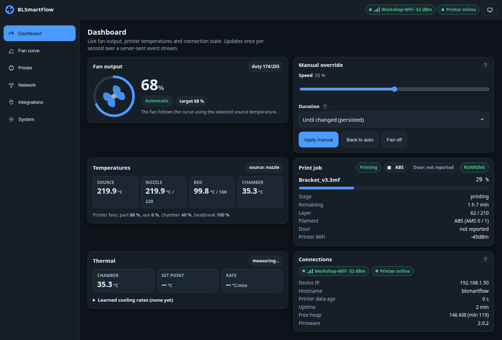

# Manual override

The **Manual override** card on the dashboard takes the fan away from the curve — for a while, or
until you change it back.



## Applying one

1. Drag **Speed** to the percentage you want. It is applied to both enabled outputs; values below the
   configured minimum speed are still clamped to 0 %.
2. Pick a **Duration**:
    - ***Until changed (persisted)*** — the manual speed survives a reboot, until you switch back.
    - **A timed option** — the device returns to the curve on its own when the timer expires. Timed
      overrides are deliberately **not** persisted, so a reboot ends them.
3. Press **Apply manual**.

**Back to auto** returns to curve control. **Fan off** forces both outputs to 0 % and keeps them
there until you change the mode again.

## What an override ignores

While manual (or off) is in force, **everything** temperature-driven is skipped: the curve, the
thermostat, the door rule, the preheat rule, the stale-data failsafe and the ventilation floor. That
is the point of it — you asked for a fixed speed.

The status LED shows a **solid light with two short dips every three seconds** while an override is
active, so you can tell from across the room that the fan is not following the curve.

## Timed overrides

A timed override is the safer choice for "let me just check something". The device logs the
expiry, clears the deadline and writes the mode back to `auto` on its own. Durations are clamped to
24 hours.

The dashboard counts the remaining time down; the API reports it as `fan.manualExpiresSec`.

## From Home Assistant

Setting the fan entity from Home Assistant puts the device into **manual mode** — that is what a fan
entity means. Remember to set the *Mode* select back to `auto` to hand control back to the curve.
→ [Home Assistant](home-assistant.md)

## From a script

```sh
H=http://blsmartflow.local

curl -X POST -d '{"mode":"manual","speed":60,"durationSec":600}' $H/api/fan   # 60 % for 10 minutes
curl -X POST -d '{"mode":"manual","speed":40}'                  $H/api/fan   # 40 %, persisted
curl -X POST -d '{"mode":"auto"}'                               $H/api/fan   # back to the curve
curl -X POST -d '{"mode":"off"}'                                $H/api/fan   # both outputs at 0 %
```

Full details, including the error responses: [`POST /api/fan`](../technical/rest-api.md#fan-control).
