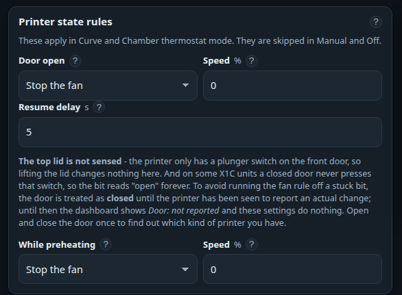

# Printer state rules

A curve only knows how hot something is. It cannot know that you have just opened the printer, or
that the bed is still climbing to temperature — and in both of those situations the *right* fan speed
has nothing to do with the reading.

The **Printer state rules** card on the *Fan curve* page covers exactly those two cases. Both rules
sit **above** the curve and above the thermostat: while one of them applies, it decides the output
whatever the temperature says. They are skipped in Manual and Off mode.

## What the printer tells us

Two things arrive over the [printer link](../technical/printer-link.md):

- **The front-door switch** — a small plunger switch on the door edge.
- **A stage number**, which the device turns into a **phase**: the one word that best describes what
  the printer is doing.

!!! danger "The top lid is not sensed"
    Bambu printers have **no sensor on the top lid at all**. Lifting it is invisible to everything on
    this page, to Home Assistant and to the API. Nothing can be done about that from this end.

### The phases

| Chip | What it means |
|---|---|
| **Idle** | The printer is on, but there is no job running. |
| **Preheating** | The bed, hotend or chamber is still coming up to temperature. |
| **Printing** | The job is running at temperature. |
| **Paused** | The job is suspended — by you, by a filament runout, or by an error. |
| **Cooling** | The printer is deliberately shedding heat. |
| **Finished – cooling** | The print is done and the chamber is still being emptied of heat. |
| **Failed** | The print stopped with an error. |
| **Offline** | Nothing has been heard from the printer. |

"Preheating" is a little cleverer than the printer's own state: even when the printer already calls
itself *running*, the device treats it as a preheat while the **bed is more than 3 °C below its
target** or the **chamber is more than 2 °C below its own**. That is the window in which a fan does
the most harm.

The exact rules are in [the control loop](../technical/control-loop.md#print-phase).

## Does your printer report the door at all?

Not every X1C does. On some units the closed door never quite presses the switch, so the printer
reports "open" from the moment it powers on and never changes. A fan rule built on that would sit
switched off for every print.

So **the device does not believe the bit until it has seen it change.** Until then:

- the dashboard shows a muted **Door: not reported** chip,
- the door is treated as **closed**, and
- the door rule below does nothing at all.

!!! tip "Prove the switch once"
    **Open and close the front door** while the device is connected. If the chip turns into *Door
    open* / *Door closed*, your printer reports properly and the rule is live from then on. If it
    stays *not reported*, yours is one of the affected units.
    → [Door not reported](../troubleshooting/door-not-reported.md)

The first report after a reconnect only establishes the state — it is deliberately **not** counted as
a change, or every MQTT reconnect would look like someone opening the printer.

## The door rule

| Setting | What it does |
|---|---|
| **Door open** | *Ignore – carry on* (the old behaviour), *Stop the fan*, or *Fixed speed*. |
| **Speed** | Used only by *Fixed speed*. |
| **Resume delay** | How long the rule stays in force after the door closes. 0–300 s, default 5. |

**Why you would want it.** With the printer open there is nothing to exhaust. The fan just pulls room
air — and the dust in it — straight through the machine, and on a heated-chamber print it throws away
the warmth you were holding. *Stop the fan* is the usual answer; *Fixed speed* at 10–20 % is worth it
if you want fumes to keep drifting towards a filter while you lean in.

**Why the resume delay.** Fitting a part or swapping filament means opening and shutting the door
several times in a minute. Without a delay the fan would stutter on and off through the whole
operation. Five seconds is plenty.

!!! note "One deliberate exception"
    After a print, an open door *helps* the chamber cool down. So the rule is skipped entirely during
    the **Finished – cooling**, **Cooling** and **Idle** phases — open the door and the fan keeps
    running, which is exactly what you want.

## The preheat rule

| Setting | What it does |
|---|---|
| **While preheating** | *Ignore*, **Stop the fan** (the default), or *Fixed speed*. |
| **Speed** | Used only by *Fixed speed*. Keep it low — anything more and the heaters spend their power on the room. |

**Why you would want it.** An exhaust fan running during warm-up is fighting the heaters. The print
starts later, it costs more power, and on an enclosed printer the chamber may never reach its target
at all. Stopping the fan until the printer is at temperature costs you nothing — there is no heat to
remove yet.

## Which rule is in charge?

The chip in the corner of the **Fan mode** card, and the badge on the dashboard's *Fan output* card,
always name the **effective mode**: `Door open`, `Preheating`, `Stale data – failsafe`, `Automatic`,
`Chamber thermostat`, `Cool-down`, `Idle`, `Manual` or `Off`.

If the fan is not doing what you expect, that badge is the first place to look.

---

Related: [Fan modes](fan-modes.md) · [Dashboard](dashboard.md) ·
[Control loop](../technical/control-loop.md) ·
[Fan stays off during preheat](../troubleshooting/fan-behaviour.md)
